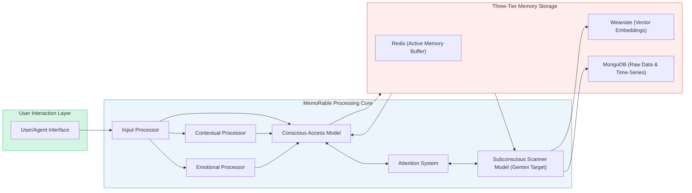
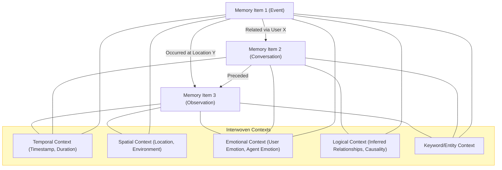

# MemoRable 🧠 - Total Recall

[](https://nodejs.org/)
[](https://www.npmjs.com/package/memorable)
[](https://opensource.org/licenses/MIT)
[](https://www.docker.com/)
[](https://hume.ai)
[](https://mindfulmoments.io)
[](https://www.mongodb.com/)
[](https://redis.io/)
[](https://weaviate.io/)

An advanced AI memory system enabling personalized, context-aware interactions through sophisticated memory management and emotional intelligence. Experience it live at [mindfulmoments.io](https://mindfulmoments.io) - your companion for mindfulness and personal growth through AI-powered emotional mirroring.

## UNDER DEVELOPMENT ETA MAY 19TH (collab rules below)

## 💡 Core Concepts

MemoRable is designed around the following core principles:

*   **Context Conductor**: The system serves as a "context conductor" for AI agents, meticulously managing and providing relevant information to enable focused and effective task execution.
*   **Memory as Identity**: We believe that personality is fundamentally derived from memory. The profound impact of amnesia on identity underscores this concept, highlighting how a rich, accessible memory is crucial for a coherent sense of self, even for an AI.
*   **Interwoven Contexts**: Memory items are not stored in isolation. Instead, they interleave temporal, spatial, emotional, and reasoning contexts, creating a rich, multi-dimensional tapestry of experience.
*   **Total Recall Aim**: The ultimate goal is to equip AI agents with "total recall," mirroring human-like memory capabilities for comprehensive understanding and interaction.
*   **Novelty and First Principles**: This project explores uncharted territory in AI memory. We are committed to thinking from first principles to develop a truly innovative solution.
*   **Alliterative Naming**: To enhance clarity and memorability, we strive to use alliterative names for key components and concepts (e.g., "Context Conductor," "Memory Mesh").

---
## 🌟 Features

- **TaskHopper System**
  - Intelligent task management and prioritization
  - Step-by-step progress tracking
  - AI task integration and automation
  - Task relationship mapping
  - Automated task archival
- **Multi-modal Input Processing**
  - Text, vision, audio, and video processing
  - AI response handling
  - File management
  - Extensible sensor framework
- **Night Processing Intelligence**
  - Automated pattern analysis (1 AM - 4 AM)
  - Model performance optimization
  - Cache warming strategies
  - Memory usage predictions
  - Task pattern analysis
- **Contextual Indexing**
  - Environmental data tracking
  - Temporal awareness
  - Task context management
  - Conversation history
  - Geospatial integration
- **Advanced Emotional Intelligence**
  - 83 distinct emotional vectors including:
    - Core emotions (joy, sadness, anger, etc.)
    - Complex emotions (nostalgia, contemplation, aesthetic appreciation)
    - Social emotions (empathic pain, adoration, triumph)
    - Cognitive states (concentration, confusion, realization)
  - Multi-modal emotion detection
  - Cross-referenced emotional context
  - Real-time emotional state analysis
  - Color-coded emotional visualization
- **Three-tier Memory Architecture**
  - Raw data storage (MongoDB)
  - Vector embeddings (Weaviate)
  - Active memory buffer (Redis)
- **Custom Model Training**
  - Personalized emotional pattern recognition
  - User-specific interaction learning
  - Adaptive response calibration
  - Continuous model improvement
  - Fine-tuning capabilities for:
    - Emotional recognition accuracy
    - Personal interaction style
    - Context sensitivity
    - Response generation

---
## 🎯 Use Cases

MemoRable's advanced memory capabilities unlock a variety of powerful applications for AI agents:

*   **Emotionally Safe Friend**: An agent that remembers past interactions, preferences, and emotional states, fostering a reliable and understanding companionship.
*   **Persistent Project Partner**: An AI assistant that maintains deep, evolving knowledge of ongoing tasks and projects, providing consistent and context-aware support.
*   **Living Git Log**: An agent with real-time awareness of codebase changes, able to explain the history, rationale, and impact of modifications.
*   **Rogerian Reflector**: An AI that facilitates self-reflection by mirroring and rephrasing user inputs, promoting deeper understanding and personal growth, inspired by Rogerian psychotherapy.
*   **Focused & Familiar Agent**: Agents that can maintain unwavering focus on tasks and consistently recognize users across interactions, building rapport and trust.

---

## 🏗️ System Architecture

MemoRable employs a sophisticated architecture designed for "total recall," featuring a dual-model processing system and a three-tier memory storage solution.

### Dual-Model Memory Processing

The core of MemoRable's intelligence lies in its innovative dual-model approach to memory management, inspired by human cognitive processes:

*   **Subconscious Scanner (Gemini Target)**: A powerful Large Language Model (initially targeting Gemini) continuously scans, processes, and indexes the vast corpus of long-term memory. It identifies patterns, relationships, and potential relevancies, acting as a background process that enriches and organizes memory.
*   **Conscious Access Model**: This model directly interfaces with the AI agent's operational needs. When the agent requires information or context, this model queries the insights and pre-processed data surfaced by the Subconscious Scanner, enabling fast and relevant memory retrieval.
*   **Adaptive Context Windows**: The interaction between these models utilizes adaptable context windows, allowing for efficient processing by focusing attention and resources dynamically based on task demands.



This architecture allows for efficient large-scale memory management, mimicking how humans might pay less conscious attention to routine information while being able to quickly access relevant details when needed.

### Memory Weaving: The Fabric of Understanding

A key concept in MemoRable is "Memory Weaving," where individual memory items are not stored in isolation but are intricately linked through multiple contextual threads.


This rich tapestry of interwoven temporal, spatial, emotional, logical, and keyword/entity contexts allows the AI to form a deeper, more nuanced understanding of past experiences and retrieve information in a highly flexible and human-like manner.

---
## 🛠️ Tech Stack

MemoRable leverages a modern, robust technology stack, all orchestrated within a **Dockerized environment** for consistent deployment and scalability:

- **Node.js/NPM**: For the core application runtime and package management.
- **MongoDB**: Serves as the persistent storage solution for raw memory data and time-series information.
- **Weaviate**: Powers the advanced vector search capabilities, enabling efficient similarity searches across memory embeddings.
- **Redis**: Utilized as an active memory buffer for frequently accessed data and caching.
- **Docker**: Ensures a consistent development, testing, and production environment.
- **Ollama**: Provides access to various AI models for reasoning and generation.
- **TensorFlow.js**: Used for client-side machine learning tasks.
- **Hume.ai**: Integrated for sophisticated emotion analysis and understanding.
- **Custom Embedding Solutions**: Developed in-house for tailored data representation.

## 📋 Prerequisites

- Node.js >= 18.0.0
- Docker and Docker Compose
---
## 📈 Current Status

MemoRable is currently in the initial development phase, focusing on establishing core functionalities. Key areas of active development include:

*   Robust session management.
*   Accurate identity recognition across interactions.
*   Foundational memory storage architecture, integrating MongoDB for persistence, Weaviate for vector search, and Redis for active memory buffering.

The immediate goal is to complete a proof-of-concept demonstrating these core capabilities, paving the way for the integration of advanced transformer models for memory processing.

---
## 🗺️ Roadmap

Our development roadmap is focused on iteratively building towards the full vision of "total recall":

1.  **Finalize Core Infrastructure**: Complete the setup of the npm package, implement core classes for session and memory management, and establish a comprehensive test framework.
2.  **Proof of Concept (PoC) Validation**: Execute and thoroughly validate the PoC, ensuring reliable identity tracking, session handling, and basic memory operations.
3.  **Subconscious Scanner Integration (Gemini)**: Begin the integration of a powerful Large Language Model (initially targeting Gemini) to act as the "Subconscious Scanner," responsible for continuously processing and indexing the entirety of long-term memory.
4.  **Conscious Access Model Development**: Design and implement the "Conscious Access Model," which will interface with the AI agent and leverage the insights provided by the Subconscious Scanner for contextually relevant memory retrieval.
5.  **Memory Weaving & Contextualization**: Refine and implement the mechanisms for "memory weaving," enabling the system to create and utilize rich, interwoven contexts (temporal, spatial, emotional, logical) for more nuanced understanding and recall.
6.  **Advanced Feature Implementation**: Incrementally build out support for the advanced features and use cases outlined, including multi-modal input processing, night processing intelligence, and sophisticated emotional analysis.
7.  **Community Collaboration**: Foster an open environment for contributions, feedback, and collaborative development to accelerate progress and broaden the project's impact.

We are excited about the journey ahead and welcome developers to join us in building the future of AI memory.
- MongoDB
- Redis
- Weaviate
- Ollama
- Hume.ai API key

## 🚀 Quick Start

1. **Clone the repository**
```bash
git clone https://github.com/yourusername/memorable.git
cd memorable
```

2. **Install dependencies**
```bash
pnpm install
```

3. **Set up environment variables**
```bash
cp .env.example .env
# Edit .env with your configuration
```

4. **Start the services**
```bash
pnpm run docker:up
```

5. **Run the application**
```bash
pnpm start
```

## 💻 Development

1. **Start in development mode**
```bash
pnpm run dev
```

2. **Run tests**
```bash
pnpm test
```

3. **Lint code**
```bash
pnpm run lint
```

## 🏛️ Project Structure

```
memorable/
├── src/
│   ├── config/           # Configuration files
│   ├── core/             # Core system components
│   ├── models/           # Data models
│   ├── services/         # Business logic
│   ├── utils/            # Utility functions
│   └── index.js          # Application entry point
├── tests/                # Test files
├── docker/               # Docker configuration
├── docs/                 # Documentation
└── scripts/             # Utility scripts
```

## 🔧 Configuration

The system can be configured through environment variables:

- `MONGODB_URI`: MongoDB connection string
- `REDIS_URL`: Redis connection URL
- `WEAVIATE_URL`: Weaviate instance URL
- `OLLAMA_API_KEY`: Ollama API key
- `HUME_API_KEY`: Hume.ai API key
- `PORT`: Application port (default: 3000)

## 📖 Documentation

Detailed documentation is available in the [docs](./docs) directory:

- [Technical Architecture](./docs/technical-architecture.md)
- [Deployment Guide](./docs/deployment-guide.md)
- [API Reference](./docs/api-reference.md)
- [Development Guide](./docs/development-guide.md)
- [Emotion Processing](./docs/emotion-processing.md)
- [Custom Models](./docs/custom-models.md)

## Collaboration

We warmly welcome contributions to the memoRable project! Your insights and efforts can help us push the boundaries of AI memory and create a truly impactful system.

For more detailed information on how to contribute, including our development process, coding standards, and code of conduct, please see our [Contribution Guidelines](CONTRIBUTING.md).
There are many ways to get involved:
*   We welcome contributions of all kinds, from documentation improvements to new feature implementations.
*   Check out our [Issue Tracker](https://github.com/yourusername/memorable/issues) for open tasks and areas where help is needed. (Please replace `yourusername/memorable` with the actual repository path if different).
*   Feel free to open an issue to discuss potential changes or new ideas.

We are particularly interested in expertise in areas such as:
*   Advanced transformer models and their application to memory processing.
*   Innovative embedding strategies for rich contextual understanding.
*   System optimization for performance and scalability.

For insights into our current thinking on key components, you might find the following document useful:
*   [Detailed Embedding Service Strategy and Model Considerations](docs/embedding_service_strategy.md)

---
## 🤝 Contributing

1. Fork the repository
2. Create your feature branch (`git checkout -b feature/amazing-feature`)
3. Commit your changes (`git commit -m 'Add amazing feature'`)
4. Push to the branch (`git push origin feature/amazing-feature`)
5. Open a Pull Request

## 📄 License

This project is licensed under the MIT License - see the [LICENSE](LICENSE) file for details.

## 🌟 Try it Live

Experience MemoRable in action at [mindfulmoments.io](https://mindfulmoments.io) - a mindfulness and mirroring application that helps you understand how AI and the world perceive you, supporting your personal development and success journey.

## 🙏 Acknowledgments

- [Hume.ai](https://hume.ai) team for their incredible emotion AI technology
- TensorFlow.js team for machine learning capabilities
- Weaviate team for vector database functionality
- MongoDB team for time series database support
- Redis team for in-memory data store
- Ollama team for AI model support