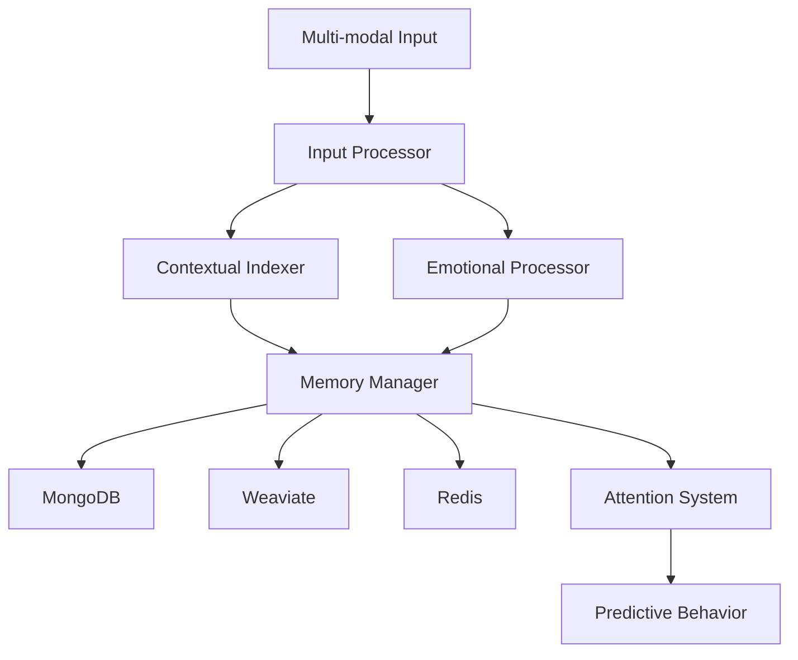

# MemoRable 🧠

[](https://nodejs.org/)
[](https://www.npmjs.com/package/memorable)
[](https://opensource.org/licenses/MIT)
[](https://www.docker.com/)

An advanced AI memory system enabling personalized, context-aware interactions through sophisticated memory management and emotional intelligence.

## 🌟 Features

- **Multi-modal Input Processing**
  - Text, vision, audio, and video processing
  - AI response handling
  - File management
  - Extensible sensor framework

- **Contextual Indexing**
  - Environmental data tracking
  - Temporal awareness
  - Task context management
  - Conversation history
  - Geospatial integration

- **Emotional Intelligence**
  - 83 emotional vector processing
  - Multi-modal emotion detection
  - Cross-referenced emotional context
  - Real-time emotional state analysis

- **Three-tier Memory Architecture**
  - Raw data storage (MongoDB)
  - Vector embeddings (Weaviate)
  - Active memory buffer (Redis)

## 🏗️ Architecture



## 🛠️ Tech Stack

- Node.js/NPM
- MongoDB (time series)
- Weaviate (vector database)
- Redis (active memory)
- Docker
- Ollama (AI models)
- TensorFlow.js
- Custom embedding solutions

## 📋 Prerequisites

- Node.js >= 18.0.0
- Docker and Docker Compose
- MongoDB
- Redis
- Weaviate
- Ollama

## 🚀 Quick Start

1. **Clone the repository**
```bash
git clone https://github.com/yourusername/memorable.git
cd memorable
```

2. **Install dependencies**
```bash
npm install
```

3. **Set up environment variables**
```bash
cp .env.example .env
# Edit .env with your configuration
```

4. **Start the services**
```bash
npm run docker:up
```

5. **Run the application**
```bash
npm start
```

## 💻 Development

1. **Start in development mode**
```bash
npm run dev
```

2. **Run tests**
```bash
npm test
```

3. **Lint code**
```bash
npm run lint
```

## 🏛️ Project Structure

```
memorable/
├── src/
│   ├── config/           # Configuration files
│   ├── core/             # Core system components
│   ├── models/           # Data models
│   ├── services/         # Business logic
│   ├── utils/            # Utility functions
│   └── index.js          # Application entry point
├── tests/                # Test files
├── docker/               # Docker configuration
├── docs/                 # Documentation
└── scripts/              # Utility scripts
```

## 🔧 Configuration

The system can be configured through environment variables:

- `MONGODB_URI`: MongoDB connection string
- `REDIS_URL`: Redis connection URL
- `WEAVIATE_URL`: Weaviate instance URL
- `OLLAMA_API_KEY`: Ollama API key
- `PORT`: Application port (default: 3000)

## 📖 Documentation

Detailed documentation is available in the [docs](./docs) directory:

- [Architecture Overview](./docs/architecture.md)
- [API Reference](./docs/api.md)
- [Development Guide](./docs/development.md)
- [Deployment Guide](./docs/deployment.md)

## 🤝 Contributing

1. Fork the repository
2. Create your feature branch (`git checkout -b feature/amazing-feature`)
3. Commit your changes (`git commit -m 'Add amazing feature'`)
4. Push to the branch (`git push origin feature/amazing-feature`)
5. Open a Pull Request

## 📄 License

This project is licensed under the MIT License - see the [LICENSE](LICENSE) file for details.

## 🙏 Acknowledgments

- TensorFlow.js team for machine learning capabilities
- Weaviate team for vector database functionality
- MongoDB team for time series database support
- Redis team for in-memory data store
- Ollama team for AI model support