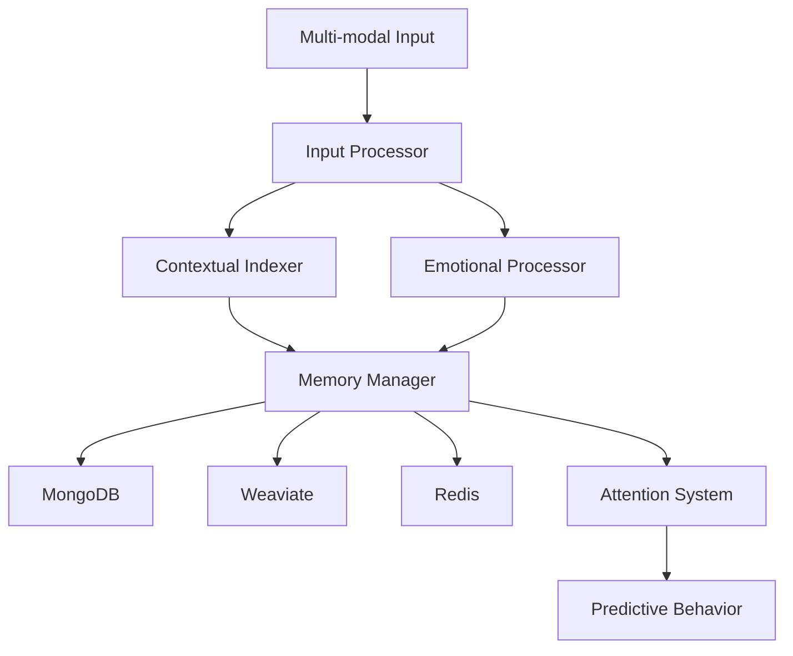

# MemoRable 🧠 - Total Recall

[](https://nodejs.org/)
[](https://www.npmjs.com/package/memorable)
[](https://opensource.org/licenses/MIT)
[](https://www.docker.com/)
[](https://hume.ai)
[](https://mindfulmoments.io)
[](https://www.mongodb.com/)
[](https://redis.io/)
[](https://weaviate.io/)

An advanced AI memory system enabling personalized, context-aware interactions through sophisticated memory management and emotional intelligence. Experience it live at [mindfulmoments.io](https://mindfulmoments.io) - your companion for mindfulness and personal growth through AI-powered emotional mirroring.

## 💡 Core Concepts

MemoRable is designed around the following core principles:

*   **Context Conductor**: The system serves as a "context conductor" for AI agents, meticulously managing and providing relevant information to enable focused and effective task execution.
*   **Memory as Identity**: We believe that personality is fundamentally derived from memory. The profound impact of amnesia on identity underscores this concept, highlighting how a rich, accessible memory is crucial for a coherent sense of self, even for an AI.
*   **Interwoven Contexts**: Memory items are not stored in isolation. Instead, they interleave temporal, spatial, emotional, and reasoning contexts, creating a rich, multi-dimensional tapestry of experience.
*   **Total Recall Aim**: The ultimate goal is to equip AI agents with "total recall," mirroring human-like memory capabilities for comprehensive understanding and interaction.
*   **Novelty and First Principles**: This project explores uncharted territory in AI memory. We are committed to thinking from first principles to develop a truly innovative solution.
*   **Alliterative Naming**: To enhance clarity and memorability, we strive to use alliterative names for key components and concepts (e.g., "Context Conductor," "Memory Mesh").

---
## 🌟 Features

- **TaskHopper System**
## 🎯 Use Cases

MemoRable's advanced memory capabilities unlock a variety of powerful applications for AI agents:

*   **Emotionally Safe Friend**: An agent that remembers past interactions, preferences, and emotional states, fostering a reliable and understanding companionship.
*   **Persistent Project Partner**: An AI assistant that maintains deep, evolving knowledge of ongoing tasks and projects, providing consistent and context-aware support.
*   **Living Git Log**: An agent with real-time awareness of codebase changes, able to explain the history, rationale, and impact of modifications.
*   **Rogerian Reflector**: An AI that facilitates self-reflection by mirroring and rephrasing user inputs, promoting deeper understanding and personal growth, inspired by Rogerian psychotherapy.
*   **Focused & Familiar Agent**: Agents that can maintain unwavering focus on tasks and consistently recognize users across interactions, building rapport and trust.

---
  - Intelligent task management and prioritization
  - Step-by-step progress tracking
  - AI task integration and automation
  - Task relationship mapping
  - Automated task archival

- **Multi-modal Input Processing**
  - Text, vision, audio, and video processing
  - AI response handling
  - File management
  - Extensible sensor framework

- **Night Processing Intelligence**
  - Automated pattern analysis (1 AM - 4 AM)
  - Model performance optimization
  - Cache warming strategies
  - Memory usage predictions
  - Task pattern analysis

- **Contextual Indexing**
  - Environmental data tracking
  - Temporal awareness
  - Task context management
  - Conversation history
  - Geospatial integration

- **Advanced Emotional Intelligence**
  - 83 distinct emotional vectors including:
    - Core emotions (joy, sadness, anger, etc.)
    - Complex emotions (nostalgia, contemplation, aesthetic appreciation)
    - Social emotions (empathic pain, adoration, triumph)
    - Cognitive states (concentration, confusion, realization)
  - Multi-modal emotion detection
  - Cross-referenced emotional context
  - Real-time emotional state analysis
  - Color-coded emotional visualization

- **Three-tier Memory Architecture**
  - Raw data storage (MongoDB)
  - Vector embeddings (Weaviate)
  - Active memory buffer (Redis)

- **Custom Model Training**
  - Personalized emotional pattern recognition
  - User-specific interaction learning
  - Adaptive response calibration
  - Continuous model improvement
  - Fine-tuning capabilities for:
    - Emotional recognition accuracy
    - Personal interaction style
    - Context sensitivity
    - Response generation

## 🏗️ Architecture



## 🛠️ Tech Stack

MemoRable leverages a modern, robust technology stack, all orchestrated within a **Dockerized environment** for consistent deployment and scalability:

- **Node.js/NPM**: For the core application runtime and package management.
- **MongoDB**: Serves as the persistent storage solution for raw memory data and time-series information.
- **Weaviate**: Powers the advanced vector search capabilities, enabling efficient similarity searches across memory embeddings.
- **Redis**: Utilized as an active memory buffer for frequently accessed data and caching.
- **Docker**: Ensures a consistent development, testing, and production environment.
- **Ollama**: Provides access to various AI models for reasoning and generation.
- **TensorFlow.js**: Used for client-side machine learning tasks.
- **Hume.ai**: Integrated for sophisticated emotion analysis and understanding.
- **Custom Embedding Solutions**: Developed in-house for tailored data representation.

## 📋 Prerequisites

- Node.js >= 18.0.0
- Docker and Docker Compose
- MongoDB
- Redis
- Weaviate
- Ollama
- Hume.ai API key

## 🚀 Quick Start

1. **Clone the repository**
```bash
git clone https://github.com/yourusername/memorable.git
cd memorable
```

2. **Install dependencies**
```bash
npm install
```

3. **Set up environment variables**
```bash
cp .env.example .env
# Edit .env with your configuration
```

4. **Start the services**
```bash
npm run docker:up
```

5. **Run the application**
```bash
npm start
```

## 💻 Development

1. **Start in development mode**
```bash
npm run dev
```

2. **Run tests**
```bash
npm test
```

3. **Lint code**
```bash
npm run lint
```

## 🏛️ Project Structure

```
memorable/
├── src/
│   ├── config/           # Configuration files
│   ├── core/             # Core system components
│   ├── models/           # Data models
│   ├── services/         # Business logic
│   ├── utils/            # Utility functions
│   └── index.js          # Application entry point
├── tests/                # Test files
├── docker/               # Docker configuration
├── docs/                 # Documentation
└── scripts/             # Utility scripts
```

## 🔧 Configuration

The system can be configured through environment variables:

- `MONGODB_URI`: MongoDB connection string
- `REDIS_URL`: Redis connection URL
- `WEAVIATE_URL`: Weaviate instance URL
- `OLLAMA_API_KEY`: Ollama API key
- `HUME_API_KEY`: Hume.ai API key
- `PORT`: Application port (default: 3000)

## 📖 Documentation

Detailed documentation is available in the [docs](./docs) directory:

- [Technical Architecture](./docs/technical-architecture.md)
- [Deployment Guide](./docs/deployment-guide.md)
- [API Reference](./docs/api-reference.md)
- [Development Guide](./docs/development-guide.md)
- [Emotion Processing](./docs/emotion-processing.md)
- [Custom Models](./docs/custom-models.md)

## 🤝 Contributing

1. Fork the repository
2. Create your feature branch (`git checkout -b feature/amazing-feature`)
3. Commit your changes (`git commit -m 'Add amazing feature'`)
4. Push to the branch (`git push origin feature/amazing-feature`)
5. Open a Pull Request

## 📄 License

This project is licensed under the MIT License - see the [LICENSE](LICENSE) file for details.

## 🌟 Try it Live

Experience MemoRable in action at [mindfulmoments.io](https://mindfulmoments.io) - a mindfulness and mirroring application that helps you understand how AI and the world perceive you, supporting your personal development and success journey.

## 🙏 Acknowledgments

- [Hume.ai](https://hume.ai) team for their incredible emotion AI technology
- TensorFlow.js team for machine learning capabilities
- Weaviate team for vector database functionality
- MongoDB team for time series database support
- Redis team for in-memory data store
- Ollama team for AI model support