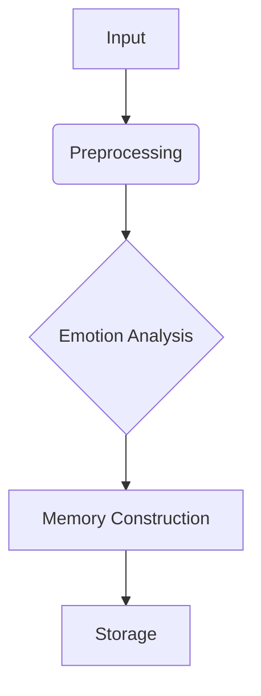

# Core Concepts

## Key Components
- **Memory Steward**: Manages memory storage/retrieval ([implementation](src/services/ingestion_service/memory_steward.ts))
- **Preprocessing Prism**: Handles input normalization ([code](src/services/ingestion_service/preprocessing_prism.ts))
- **Memento Constructor**: Builds memory structures ([source](src/services/ingestion_service/memento_constructor.ts))

## Fundamental Processes

## Key Terms
- **Memento**: Atomic memory unit (see [models](src/services/ingestion_service/models.ts))
- **Cognitive Layer**: Abstracted processing level ([details](docs/technical-architecture.md))