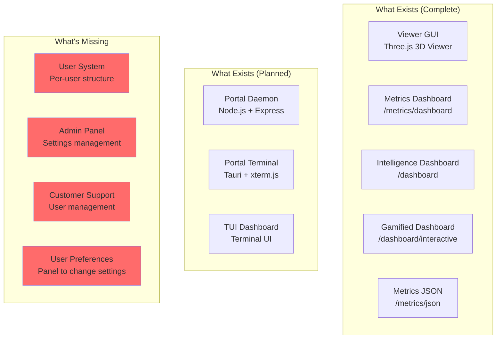
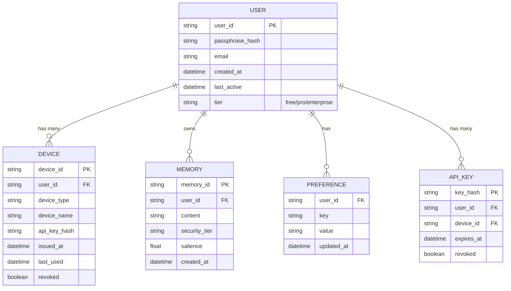
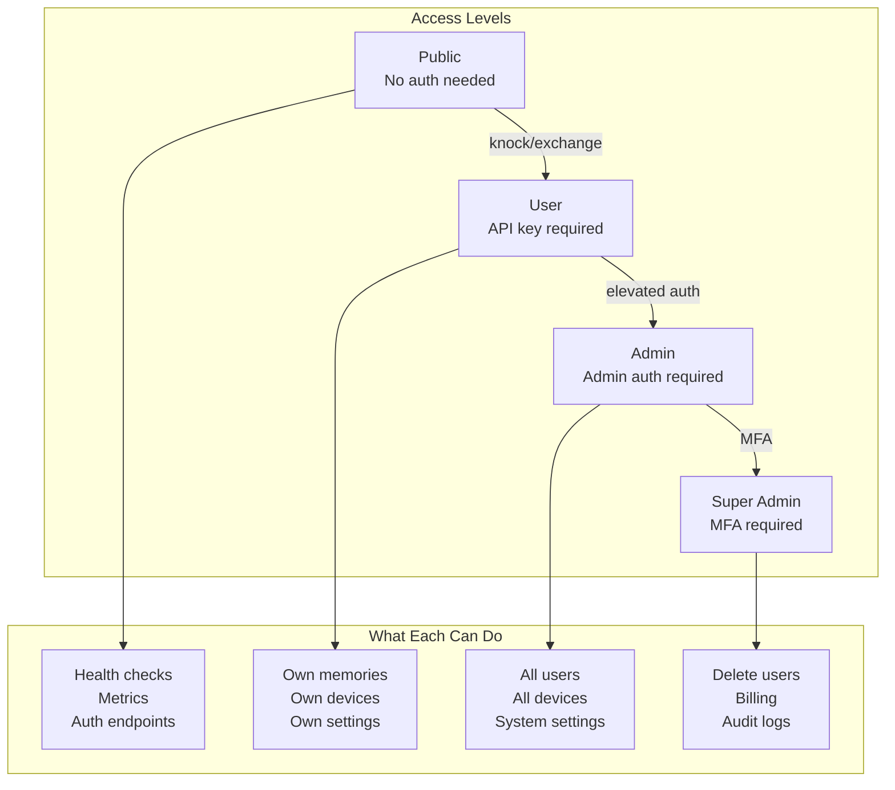

# UI and User System Plan

> Document first, code second. - Alan's Rule

## Current State Inventory



## What We Need

### 1. Per-User Structure (Stack Independent)



### 2. Admin/Settings Panel Architecture

```mermaid
graph LR
    subgraph "Public (No Auth)"
        H[/health]
        M[/metrics]
        AK[/auth/knock]
        AE[/auth/exchange]
    end

    subgraph "User Auth Required"
        MEM[/memory/*]
        CTX[/context/*]
        LOOP[/loops/*]
    end

    subgraph "Admin Panel (New)"
        DASH[/admin/dashboard]
        USERS[/admin/users]
        DEVICES[/admin/devices]
        SETTINGS[/admin/settings]
        SUPPORT[/admin/support]
    end

    subgraph "User Settings (New)"
        UPROF[/user/profile]
        UPREF[/user/preferences]
        UDEV[/user/devices]
        UPASS[/user/passphrase]
    end

    AK --> AE --> MEM
    MEM --> UPROF
    DASH --> USERS --> SUPPORT
```

### 3. Simple UI Philosophy (Like Ollama)

```
┌─────────────────────────────────────────────────────────────┐
│  MemoRable Admin                              [user] [logout]│
├─────────────────────────────────────────────────────────────┤
│  ┌─────────┐ ┌─────────┐ ┌─────────┐ ┌─────────┐           │
│  │ Users   │ │ Devices │ │ Metrics │ │ Settings│           │
│  │   42    │ │   127   │ │  ✓ OK   │ │    ⚙    │           │
│  └─────────┘ └─────────┘ └─────────┘ └─────────┘           │
├─────────────────────────────────────────────────────────────┤
│                                                              │
│  Recent Activity                                             │
│  ─────────────────────────────────────────────────────────  │
│  • claude authenticated from Claude Code (2 min ago)        │
│  • betty stored memory "Doctor appointment..." (5 min ago)  │
│  • robot-001 connected via mTLS (12 min ago)                │
│                                                              │
│  System Health                                               │
│  ─────────────────────────────────────────────────────────  │
│  Memory: ████████░░ 82%    CPU: ███░░░░░░░ 34%              │
│  Disk:   ██████░░░░ 61%    Uptime: 14d 3h 22m               │
│                                                              │
└─────────────────────────────────────────────────────────────┘
```

## Task Breakdown

### Phase 1: User System Foundation
| # | Task | Priority | Depends On |
|---|------|----------|------------|
| 1.1 | Create User model (MongoDB schema) | P0 | - |
| 1.2 | Create Device model (link to user) | P0 | 1.1 |
| 1.3 | Create Preference model | P1 | 1.1 |
| 1.4 | Migrate single 'claude' user to User model | P0 | 1.1 |
| 1.5 | Update auth to support multiple users | P0 | 1.4 |
| 1.6 | User registration endpoint | P1 | 1.5 |

### Phase 2: User-Facing Settings
| # | Task | Priority | Depends On |
|---|------|----------|------------|
| 2.1 | `/user/profile` - View/edit profile | P1 | 1.5 |
| 2.2 | `/user/devices` - List/revoke devices | P1 | 1.2 |
| 2.3 | `/user/preferences` - User settings | P2 | 1.3 |
| 2.4 | `/user/passphrase` - Change passphrase | P1 | 1.5 |

### Phase 3: Admin Panel
| # | Task | Priority | Depends On |
|---|------|----------|------------|
| 3.1 | Admin authentication (separate from user) | P1 | - |
| 3.2 | `/admin/dashboard` - Overview page | P1 | 3.1 |
| 3.3 | `/admin/users` - User management | P1 | 3.1, 1.1 |
| 3.4 | `/admin/devices` - Device management | P2 | 3.1, 1.2 |
| 3.5 | `/admin/settings` - System settings | P2 | 3.1 |

### Phase 4: Customer Support Tools
| # | Task | Priority | Depends On |
|---|------|----------|------------|
| 4.1 | `/admin/support` - Support queue | P2 | 3.1 |
| 4.2 | User lookup by email/id | P2 | 3.3 |
| 4.3 | Device impersonation (support only) | P3 | 3.4 |
| 4.4 | Audit log viewer | P2 | 3.1 |

### Phase 5: Metrics Panel Tuning
| # | Task | Priority | Depends On |
|---|------|----------|------------|
| 5.1 | Review existing `/dashboard/interactive` | P1 | - |
| 5.2 | Add user-level metrics | P2 | 1.1 |
| 5.3 | Add device activity metrics | P2 | 1.2 |
| 5.4 | Export metrics to Prometheus/Grafana | P3 | - |

## Architecture Decision: Simple HTML vs Framework

**Recommendation: Continue with server-rendered HTML**

Why:
1. All existing dashboards are server-rendered (consistent)
2. No build step needed
3. Works everywhere (no JS framework knowledge needed)
4. Ollama does this - simple and effective
5. Can always add framework later if needed

Technology:
- Server-rendered HTML (like existing dashboards)
- HTMX for interactivity (if needed, no build step)
- Tailwind CSS via CDN (optional, for styling)
- Alpine.js for simple reactivity (optional)

## File Structure (Proposed)

```
src/
├── server.js                 # Main server (existing)
├── models/
│   ├── user.js              # User model (NEW)
│   ├── device.js            # Device model (NEW)
│   └── preference.js        # Preference model (NEW)
├── routes/
│   ├── auth.js              # Auth routes (extract from server.js)
│   ├── user.js              # User routes (NEW)
│   └── admin.js             # Admin routes (NEW)
├── views/
│   ├── admin/
│   │   ├── dashboard.js     # Admin dashboard HTML
│   │   ├── users.js         # User management HTML
│   │   └── settings.js      # Settings HTML
│   └── user/
│       ├── profile.js       # User profile HTML
│       └── devices.js       # Device management HTML
└── services/
    └── ... (existing)
```

## Security Considerations



## Next Steps (Immediate)

1. **Create User model** - Foundation for everything else
2. **Migrate 'claude' to real user** - First user in the system
3. **Basic admin dashboard** - Even if just metrics we have

## Questions for Alan

- [ ] Admin auth: Same passphrase system or separate?
- [ ] User registration: Open or invite-only?
- [ ] Billing tier: Free/Pro/Enterprise or simpler?
- [ ] Support tools: Zendesk integration or homebrew?

---

*Document created: 2026-01-19*
*Status: Planning*
