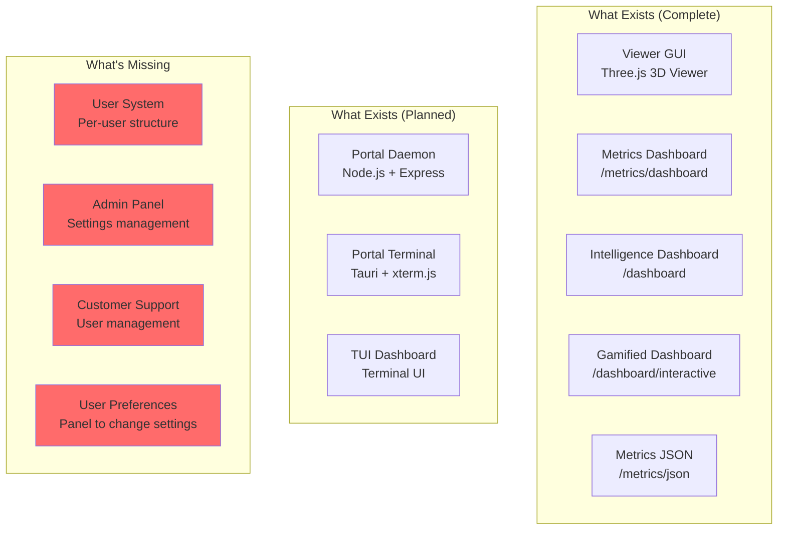
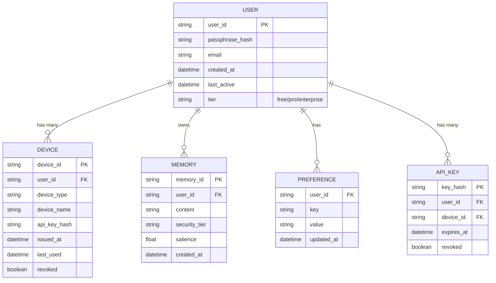
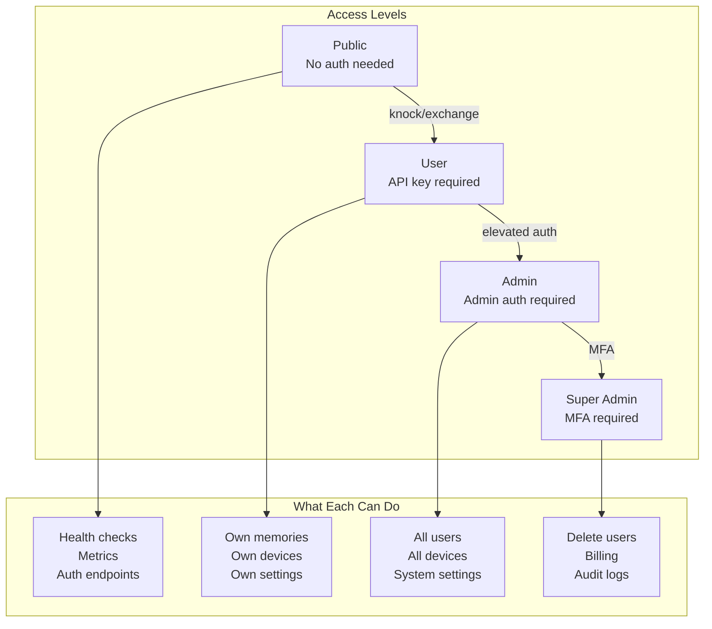
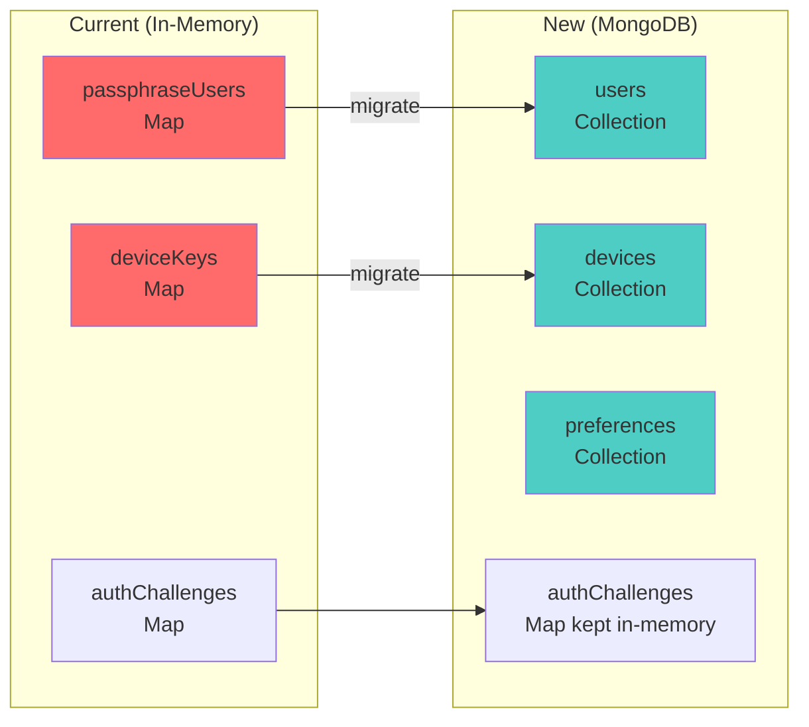
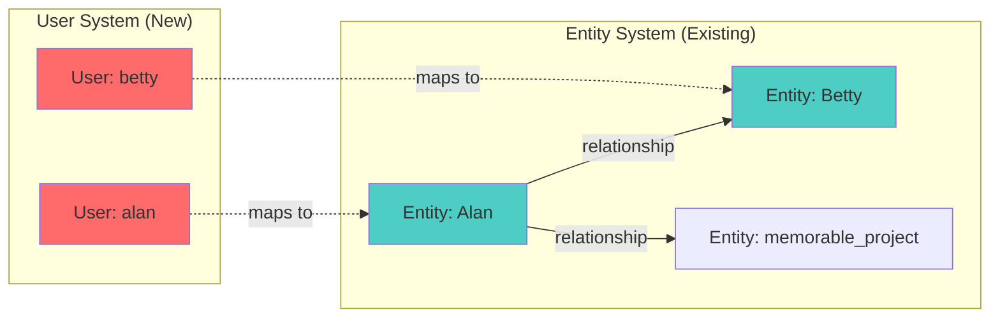

# UI and User System Plan

> Document first, code second. - Alan's Rule

## Current State Inventory



## What We Need

### 1. Per-User Structure (Stack Independent)



### 2. Admin/Settings Panel Architecture

```mermaid
graph LR
    subgraph "Public (No Auth)"
        H[/health]
        M[/metrics]
        AK[/auth/knock]
        AE[/auth/exchange]
    end

    subgraph "User Auth Required"
        MEM[/memory/*]
        CTX[/context/*]
        LOOP[/loops/*]
    end

    subgraph "Admin Panel (New)"
        DASH[/admin/dashboard]
        USERS[/admin/users]
        DEVICES[/admin/devices]
        SETTINGS[/admin/settings]
        SUPPORT[/admin/support]
    end

    subgraph "User Settings (New)"
        UPROF[/user/profile]
        UPREF[/user/preferences]
        UDEV[/user/devices]
        UPASS[/user/passphrase]
    end

    AK --> AE --> MEM
    MEM --> UPROF
    DASH --> USERS --> SUPPORT
```

### 3. Simple UI Philosophy (Like Ollama)

```
┌─────────────────────────────────────────────────────────────┐
│  MemoRable Admin                              [user] [logout]│
├─────────────────────────────────────────────────────────────┤
│  ┌─────────┐ ┌─────────┐ ┌─────────┐ ┌─────────┐           │
│  │ Users   │ │ Devices │ │ Metrics │ │ Settings│           │
│  │   42    │ │   127   │ │  ✓ OK   │ │    ⚙    │           │
│  └─────────┘ └─────────┘ └─────────┘ └─────────┘           │
├─────────────────────────────────────────────────────────────┤
│                                                              │
│  Recent Activity                                             │
│  ─────────────────────────────────────────────────────────  │
│  • claude authenticated from Claude Code (2 min ago)        │
│  • betty stored memory "Doctor appointment..." (5 min ago)  │
│  • robot-001 connected via mTLS (12 min ago)                │
│                                                              │
│  System Health                                               │
│  ─────────────────────────────────────────────────────────  │
│  Memory: ████████░░ 82%    CPU: ███░░░░░░░ 34%              │
│  Disk:   ██████░░░░ 61%    Uptime: 14d 3h 22m               │
│                                                              │
└─────────────────────────────────────────────────────────────┘
```

## Task Breakdown

### Phase 1: User System Foundation
| # | Task | Priority | Depends On |
|---|------|----------|------------|
| 1.1 | Create User model (MongoDB schema) | P0 | - |
| 1.2 | Create Device model (link to user) | P0 | 1.1 |
| 1.3 | Create Preference model | P1 | 1.1 |
| 1.4 | Migrate single 'claude' user to User model | P0 | 1.1 |
| 1.5 | Update auth to support multiple users | P0 | 1.4 |
| 1.6 | User registration endpoint | P1 | 1.5 |

### Phase 2: User-Facing Settings
| # | Task | Priority | Depends On |
|---|------|----------|------------|
| 2.1 | `/user/profile` - View/edit profile | P1 | 1.5 |
| 2.2 | `/user/devices` - List/revoke devices | P1 | 1.2 |
| 2.3 | `/user/preferences` - User settings | P2 | 1.3 |
| 2.4 | `/user/passphrase` - Change passphrase | P1 | 1.5 |

### Phase 3: Admin Panel
| # | Task | Priority | Depends On |
|---|------|----------|------------|
| 3.1 | Admin authentication (separate from user) | P1 | - |
| 3.2 | `/admin/dashboard` - Overview page | P1 | 3.1 |
| 3.3 | `/admin/users` - User management | P1 | 3.1, 1.1 |
| 3.4 | `/admin/devices` - Device management | P2 | 3.1, 1.2 |
| 3.5 | `/admin/settings` - System settings | P2 | 3.1 |

### Phase 4: Customer Support Tools
| # | Task | Priority | Depends On |
|---|------|----------|------------|
| 4.1 | `/admin/support` - Support queue | P2 | 3.1 |
| 4.2 | User lookup by email/id | P2 | 3.3 |
| 4.3 | Device impersonation (support only) | P3 | 3.4 |
| 4.4 | Audit log viewer | P2 | 3.1 |

### Phase 5: Metrics Panel Tuning
| # | Task | Priority | Depends On |
|---|------|----------|------------|
| 5.1 | Review existing `/dashboard/interactive` | P1 | - |
| 5.2 | Add user-level metrics | P2 | 1.1 |
| 5.3 | Add device activity metrics | P2 | 1.2 |
| 5.4 | Export metrics to Prometheus/Grafana | P3 | - |

## Architecture Decision: Simple HTML vs Framework

**Recommendation: Continue with server-rendered HTML**

Why:
1. All existing dashboards are server-rendered (consistent)
2. No build step needed
3. Works everywhere (no JS framework knowledge needed)
4. Ollama does this - simple and effective
5. Can always add framework later if needed

Technology:
- Server-rendered HTML (like existing dashboards)
- HTMX for interactivity (if needed, no build step)
- Tailwind CSS via CDN (optional, for styling)
- Alpine.js for simple reactivity (optional)

## File Structure (Proposed)

```
src/
├── server.js                 # Main server (existing)
├── models/
│   ├── user.js              # User model (NEW)
│   ├── device.js            # Device model (NEW)
│   └── preference.js        # Preference model (NEW)
├── routes/
│   ├── auth.js              # Auth routes (extract from server.js)
│   ├── user.js              # User routes (NEW)
│   └── admin.js             # Admin routes (NEW)
├── views/
│   ├── admin/
│   │   ├── dashboard.js     # Admin dashboard HTML
│   │   ├── users.js         # User management HTML
│   │   └── settings.js      # Settings HTML
│   └── user/
│       ├── profile.js       # User profile HTML
│       └── devices.js       # Device management HTML
└── services/
    └── ... (existing)
```

## Security Considerations



## Implementation Progress

### ✅ Phase 1.1-1.3: Models Created (2026-01-19)

**Files created:**
```
src/models/
├── index.ts      # Entry point, bootstrap functions
├── user.ts       # User model with tiers, auth tracking
├── device.ts     # Device model with API keys, mTLS support
└── preference.ts # Key-value preferences by namespace
```

**Key features implemented:**

1. **User Model** (`src/models/user.ts`)
   - Tiers: free/pro/enterprise with limits
   - Auth state: failed attempts, lockout, MFA ready
   - Usage tracking: device count, storage, memories/day
   - Admin flag for elevated access

2. **Device Model** (`src/models/device.ts`)
   - API key generation (SHA-256 hash stored, not plaintext)
   - Device types: terminal, phone, ar_glasses, robot, sensor, etc.
   - mTLS support for sensors/robots (cert fingerprint auth)
   - Independent revocation per device

3. **Preference Model** (`src/models/preference.ts`)
   - Namespaced: privacy, notifications, salience, display, etc.
   - Default preferences auto-initialized for new users
   - Salience weights integration for personalized scoring
   - Export/import for data portability

### Integration Plan: server.js Migration



**Migration steps:**
1. ✅ Create models with proper indexes
2. 🔄 Add `setupUserModels()` call to server startup
3. 🔄 Call `bootstrapClaudeUser()` to migrate first user
4. 🔄 Update auth middleware to query MongoDB
5. 🔄 Keep challenges in-memory (short-lived, no need to persist)

### Family Use Case (Why This Matters)

```
┌─────────────────────────────────────────────────────────────────────┐
│                     FAMILY DEPLOYMENT SCENARIO                       │
├─────────────────────────────────────────────────────────────────────┤
│                                                                      │
│  Alan (admin)         Betty (pro)           Kid (free)              │
│  ├── Claude Code      ├── AR glasses        ├── Phone app           │
│  ├── Terminal         ├── Companion robot   └── Web browser         │
│  └── Web browser      ├── Phone app                                 │
│                       └── Tablet                                     │
│                                                                      │
│  Each user:                                                          │
│  - Has their own passphrase (privacy within family)                 │
│  - Can manage their own devices                                     │
│  - Has personalized salience weights                                │
│  - Memories isolated by userId                                      │
│                                                                      │
│  Admin (Alan) can:                                                   │
│  - See system health                                                │
│  - Manage all users                                                 │
│  - Set tier limits                                                  │
│  - View audit logs                                                  │
│                                                                      │
└─────────────────────────────────────────────────────────────────────┘
```

### Open Questions (Resolved)

- [x] Admin auth: Same passphrase system ✓ (isAdmin flag on user)
- [x] User registration: Open (POST /auth/register endpoint)
- [x] Billing tier: Free/Pro/Enterprise ✓ (with configurable limits)
- [ ] Support tools: Start homebrew, integrate later if needed

### Key Insight: Users ARE Entities



**Users are entities with authentication.** The existing entity system handles:
- Relationship patterns (`relationship_patterns` collection)
- Interaction tracking (`person_timeline_events`)
- Open loops / commitments between entities

The user system adds:
- Authentication (passphrase → API key)
- Device management (per-device keys)
- Preferences (personalized salience weights)
- Tier limits (free/pro/enterprise)

**Memory portability**: Preferences have `exportPreferences`/`importPreferences`.
Memory export can follow the same pattern.

### Completed (2026-01-19 → 2026-01-23)

#### Phase 1: Models & Auth ✅
1. ✅ **Models created** - `src/models/user.ts`, `device.ts`, `preference.ts`, `index.ts`
2. ✅ **Server startup integration** - MongoDB connection + user models init
3. ✅ **Auth flow migrated** - MongoDB first, in-memory fallback
4. ✅ **Registration endpoint** - `POST /auth/register`

#### Phase 2: User-Facing Pages ✅
5. ✅ **Home/Hero page** - `/` with CTA buttons, feature cards, status indicator
6. ✅ **Login page** - `/login` with passphrase input, knock/exchange flow, error handling
7. ✅ **Register page** - `/register` with username + passphrase, strength meter, terms checkbox
8. ✅ **Privacy Policy** - `/privacy` with three-tier security model, temporal control
9. ✅ **Terms of Service** - `/terms` with care applications clause, data ownership
10. ✅ **Documentation page** - `/docs` with 35 MCP tools listed, auth flow, quick links
11. ✅ **User Profile** - `/user/profile` (GET + POST) - display name, email
12. ✅ **User Devices** - `/user/devices` (GET + POST /revoke) - list and revoke device keys
13. ✅ **User Preferences** - `/user/preferences` (GET + POST) - privacy, salience weights
14. ✅ **User Passphrase** - `/user/passphrase` (GET + POST) - change passphrase

#### Phase 3: Admin Panel ✅
15. ✅ **Admin Dashboard** - `/admin/dashboard` - user count, device count, memories, uptime, logs
16. ✅ **Admin Users** - `/admin/users` - user management with tier badges, status
17. ✅ **Admin User Actions** - `/admin/users/:userId/action` - suspend, tier change
18. ✅ **Admin Devices** - `/admin/devices` - all device management, revoke
19. ✅ **Admin Settings** - `/admin/settings` - system configuration

#### Phase 4: Dashboards ✅
20. ✅ **Intelligence Dashboard** - `/dashboard` - salience distribution, entities, fidelity
21. ✅ **Interactive Dashboard** - `/dashboard/interactive` - expandable sections, tabs
22. ✅ **Mission Control** - `/dashboard/mission-control` - radar, indicators, system vitals
23. ✅ **JSON Export** - `/dashboard/json` - machine-readable metrics
24. ⬜ **Calendar** - `/dashboard/calendar` - route exists, minimal content

---

## Phase 5: UX Gaps & Polish (CURRENT PHASE)

### Critical UX Issues

| # | Issue | Severity | Location | Problem |
|---|-------|----------|----------|---------|
| 1 | **No onboarding flow** | HIGH | `/register` → ? | After registration, user gets an API key but no guidance on what to do next |
| 2 | **No memory browser** | HIGH | Missing | Users can't view/search/delete their own memories from a web UI |
| 3 | **No error pages** | MEDIUM | Missing | 404, 500, auth-failed get raw JSON - no styled error pages |
| 4 | **No account deletion** | MEDIUM | `/user/profile` | GDPR/privacy requires ability to delete account + all data |
| 5 | **Calendar dashboard stub** | LOW | `/dashboard/calendar` | Route exists but content is minimal |
| 6 | **No mobile nav** | MEDIUM | All pages | Hamburger menu missing, nav breaks on small screens |
| 7 | **Cookie-only auth** | MEDIUM | Browser sessions | API key in cookie is httpOnly but not SameSite=Strict everywhere |
| 8 | **No password reset** | HIGH | Missing | If user forgets passphrase, no recovery path |
| 9 | **No email verification** | MEDIUM | `/auth/register` | Anyone can register with any username, no verification |
| 10 | **No audit log UI** | LOW | `/admin/` | Admin has no visibility into auth events, memory access |

### Missing User Journeys

```
┌──────────────────────────────────────────────────────────────────────────┐
│                     USER JOURNEY GAPS                                      │
├──────────────────────────────────────────────────────────────────────────┤
│                                                                           │
│  1. NEW USER:                                                             │
│     /register → API key shown → ??? (no next step)                       │
│     SHOULD BE: /register → welcome → setup guide → first memory          │
│                                                                           │
│  2. RETURNING USER:                                                       │
│     /login → /dashboard/mission-control                                  │
│     SHOULD BE: /login → personalized home (their memories, patterns)     │
│                                                                           │
│  3. CLAUDE CODE USER:                                                     │
│     Gets API key → configures .mcp.json → done                          │
│     SHOULD BE: /setup/claude-code → copy-paste config → verify working   │
│                                                                           │
│  4. DEVICE SETUP:                                                         │
│     POST /auth/knock + /auth/exchange (API only)                         │
│     SHOULD BE: /devices/add → QR code / setup wizard                     │
│                                                                           │
│  5. MEMORY MANAGEMENT:                                                    │
│     Only via API or MCP tools                                            │
│     SHOULD BE: /memories → browse, search, delete, export                │
│                                                                           │
│  6. FORGOT PASSPHRASE:                                                    │
│     No path exists                                                       │
│     SHOULD BE: /forgot → email verification → reset                      │
│                                                                           │
└──────────────────────────────────────────────────────────────────────────┘
```

---

## Phase 5 Task Breakdown

### 5.1 Post-Registration Onboarding (P0)
| Task | Description |
|------|-------------|
| Welcome page | `/welcome` - shows after registration, explains what MemoRable does |
| Setup guide | `/setup` - choose integration path (Claude Code, API, devices) |
| Claude Code setup | `/setup/claude-code` - copy-paste .mcp.json config with API key pre-filled |
| First memory prompt | Encourage user to store first memory to verify it works |
| Redirect chain | Register → Welcome → Setup → Dashboard |

### 5.2 Memory Browser (P0)
| Task | Description |
|------|-------------|
| Memory list | `/memories` - paginated list of user's memories with search |
| Memory detail | `/memories/:id` - view single memory with metadata, salience score |
| Memory delete | DELETE button with confirmation modal |
| Memory export | `/memories/export` - download all memories as JSON |
| Memory search | Full-text search across content, entities, tags |
| Filters | By security tier, date range, entity, salience threshold |

### 5.3 Error & Status Pages (P1)
| Task | Description |
|------|-------------|
| 404 page | Styled "memory not found" page |
| 500 page | "Something went wrong" with support link |
| Auth required | Styled redirect to login (not raw JSON) |
| Rate limited | 429 page with retry-after info |
| Maintenance | 503 page for planned downtime |

### 5.4 Account Management (P1)
| Task | Description |
|------|-------------|
| Account deletion | `/user/delete` - confirm + delete all data (GDPR) |
| Data export | `/user/export` - download all user data (GDPR) |
| Passphrase recovery | `/forgot` - email-based reset (requires email on file) |
| Email verification | Optional email verification at registration |
| Session management | List active sessions, logout from all devices |

### 5.5 Mobile Responsiveness (P1)
| Task | Description |
|------|-------------|
| Hamburger nav | Collapsible navigation on mobile |
| Touch-friendly | Larger tap targets, swipe gestures |
| Viewport meta | Ensure proper mobile viewport on all pages |
| Test breakpoints | 320px, 375px, 768px, 1024px |

### 5.6 Security Hardening (P1)
| Task | Description |
|------|-------------|
| SameSite cookies | `SameSite=Strict` on all auth cookies |
| CSP headers | Content-Security-Policy to prevent XSS |
| Rate limiting UI | Show remaining attempts on login page |
| CSRF tokens | Add to all POST forms |
| Session timeout | Auto-logout after inactivity |

### 5.7 Admin Enhancements (P2)
| Task | Description |
|------|-------------|
| Audit log viewer | `/admin/audit` - auth events, memory access, admin actions |
| User search | Search by userId, email, device type |
| Bulk actions | Suspend/activate multiple users |
| System alerts | Show warnings (disk full, high error rate, etc.) |
| Export users | CSV/JSON export of user list |

### 5.8 Integration Setup Wizards (P2)
| Task | Description |
|------|-------------|
| Claude Code wizard | `/setup/claude-code` - step-by-step with verification |
| API key management | `/user/api-keys` - create, view, revoke API keys |
| Device QR pairing | `/devices/pair` - generate QR for mobile/AR device setup |
| Webhook config | `/user/webhooks` - configure notification webhooks |

---

## Implementation Priority Order

```
P0 (Before Users):
  5.1 Onboarding flow (register → welcome → setup → dashboard)
  5.2 Memory browser (users MUST be able to see their own data)

P1 (Before Scale):
  5.3 Error pages (professional experience)
  5.4 Account management (GDPR compliance)
  5.5 Mobile responsive (phones are primary device)
  5.6 Security hardening (cookies, CSRF, CSP)

P2 (Growth):
  5.7 Admin enhancements (audit, search, bulk)
  5.8 Integration wizards (Claude Code, device pairing)
```

---

## Technology Decisions (Unchanged)

- **Server-rendered HTML** (consistent with existing dashboards)
- **No frontend framework** (Express templates, inline CSS/JS)
- **HTMX if needed** for dynamic updates without page reload
- **CDN fonts** (Orbitron, Share Tech Mono, Inter)
- **Dark theme only** (cyberpunk aesthetic, accessibility-friendly contrast)

---

## Current Route Inventory (48 endpoints)

### Public (No Auth)
| Route | Method | Page |
|-------|--------|------|
| `/` | GET | Hero/landing page |
| `/login` | GET | Login form |
| `/register` | GET | Registration form |
| `/privacy` | GET | Privacy policy |
| `/terms` | GET | Terms of service |
| `/docs` | GET | Documentation |
| `/health` | GET | Health check (JSON) |
| `/metrics` | GET | Prometheus metrics |
| `/auth/knock` | POST | Get challenge |
| `/auth/exchange` | POST | Trade passphrase for key |
| `/auth/register` | POST | Create account |

### User Auth Required
| Route | Method | Page |
|-------|--------|------|
| `/user/profile` | GET/POST | Profile view/edit |
| `/user/devices` | GET | Device list |
| `/user/devices/revoke` | POST | Revoke device |
| `/user/preferences` | GET/POST | Preferences |
| `/user/passphrase` | GET/POST | Change passphrase |
| `/dashboard/*` | GET | All dashboards |
| `/memory` | GET/POST | Memory CRUD |
| `/memory/:id` | GET/DELETE | Single memory |

### Admin Auth Required
| Route | Method | Page |
|-------|--------|------|
| `/admin/dashboard` | GET | Admin overview |
| `/admin/users` | GET | User management |
| `/admin/users/:id/action` | POST | User actions |
| `/admin/devices` | GET | All devices |
| `/admin/devices/:id/revoke` | POST | Revoke any device |
| `/admin/settings` | GET | System settings |

---

*Document created: 2026-01-19*
*Last updated: 2026-01-23*
*Status: Phases 1-4 COMPLETE | Phase 5 IN PLANNING*
*Models: ✅ | Auth: ✅ | User Pages: ✅ | Admin: ✅ | Dashboards: ✅ | Onboarding: ⬜ | Memory Browser: ⬜*
