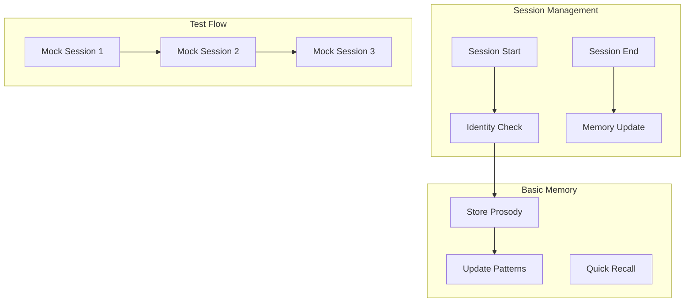

# MemoRable - Total Recall: Implementation Plan

> **HISTORICAL DOCUMENT (v1.0 Design)**
>
> This implementation plan represents the original vision. The project has evolved:
> - **Dual-Model architecture** (Gemini scanner) was simplified to single Real-Time Relevance Engine
> - **NNNA batch processing** deprecated - all processing now happens at ingest time
> - **Security Tiers** (Tier1/2/3) added for data classification and encryption
> - **23 MCP tools** implemented (see README.md)
>
> For current status, see: [LAUNCH_READINESS.md](./docs/LAUNCH_READINESS.md), [SCALABILITY_ANALYSIS.md](./docs/SCALABILITY_ANALYSIS.md)

---

## Overview

This document outlines the implementation plan for MemoRable - Total Recall, an advanced AI memory system. The goal is to provide AI agents with human-like memory capabilities, enabling "total recall" through a sophisticated, context-aware architecture.

The system will function as a "context conductor," managing and interleaving temporal, spatial, emotional, and reasoning contexts. A core design principle is the understanding that personality is derived from memory.

A key architectural innovation is the concept of a dual-model memory processing system:
*   A **Subconscious Scanner Model (Gemini)**: This model will continuously scan the full context of long-term memory.
*   A **Conscious Access Model**: This model will interact with the agent, and when memory is required, the Subconscious Scanner will provide precisely relevant information.
This approach allows for efficient large-scale memory management, with adaptable context windows for different models, mimicking human cognitive processes where less attention is paid to routine or less critical information, allowing for autonomic processing of repeated actions.

This plan initially focuses on core functionalities like session management, identity recognition, and robust memory storage (utilizing Weaviate for vector search and MongoDB for persistence, all within a Dockerized environment), and will progressively build towards the full vision. We emphasize first-principles thinking due to the novel nature of this endeavor.

## 💡 Core Concepts

The implementation will be guided by these foundational principles:

*   **Context Conductor**: The system is envisioned as a "context conductor," adept at managing and weaving together various strands of information—temporal, spatial, emotional, and logical—to provide AI agents with a rich, actionable understanding of their environment and interactions.
*   **Memory as Identity**: A central tenet is that an AI's "personality" and coherence emerge from its memories. The ability to recall and integrate past experiences is paramount for developing a consistent and believable agent identity.
*   **Interwoven Contexts**: Memories will not be simple data points but complex, interconnected nodes. Each memory item will be enriched with multiple contextual layers, allowing for nuanced retrieval and reasoning.
*   **Total Recall Aim**: The project strives to equip agents with a comprehensive and readily accessible memory, approaching a human-like "total recall" capability. This involves not just storing data, but making it meaningfully available.
*   **Novelty and First-Principles Thinking**: Recognizing the pioneering nature of this work, development will be approached with a commitment to first-principles thinking, encouraging innovative solutions over adherence to existing paradigms.
*   **Alliterative Naming**: To foster clarity and recall, key architectural components and conceptual constructs will, where fitting, be given alliterative names (e.g., "Memory Mesh," "Contextual Core").
*   **Dual-Model Memory Architecture (Conscious/Subconscious)**:
    *   **Subconscious Scanner (Gemini)**: A powerful model (initially Gemini) will be responsible for continuously scanning and indexing the vast corpus of long-term memory. It acts as a background process, identifying patterns, relationships, and potential relevancies.
    *   **Conscious Access Model**: This model directly interfaces with the AI agent's immediate operational needs. When the agent requires information, this model queries the pre-processed insights and relevant data surfaced by the Subconscious Scanner.
    *   **Adaptable Context Windows**: The interaction between these models will utilize adaptable context windows. For the Subconscious Scanner, a large context window is essential for comprehensive memory scanning. The Conscious Access Model might use smaller, more focused windows, dynamically adjusted based on task demands. This allows for efficient processing, where routine or less critical information might be handled with less "attentional" load, and some repeated actions could even become "autonomic," freeing the Conscious Access Model.

---


## Core Implementation

```javascript
// memorable.js
export class MemoRable {
  constructor() {
    this.sessions = new Map();
    this.memories = new Map();
    this.patterns = new Map();
  }

  async handleSessionStart(sessionData) {
    const sessionId = sessionData.sessionId;
    const userId = sessionData.userId;

    // Check if user exists
    const userMemory = this.memories.get(userId) || {
      chatCount: 0,
      lastSeen: null,
      patterns: []
    };

    // Update session data
    this.sessions.set(sessionId, {
      userId,
      startTime: Date.now(),
      chatCount: userMemory.chatCount + 1
    });

    return {
      isNewUser: userMemory.chatCount === 0,
      lastSeen: userMemory.lastSeen,
      patterns: userMemory.patterns
    };
  }

  async handleSessionEnd(sessionData) {
    const session = this.sessions.get(sessionData.sessionId);
    if (!session) return;

    // Update memory with session data
    await this.updateMemory(session.userId, {
      sessionLength: Date.now() - session.startTime,
      prosodyData: sessionData.prosody || [],
      patterns: sessionData.patterns || []
    });

    this.sessions.delete(sessionData.sessionId);
  }

  async processMessage(message, context) {
    const sessionId = context.sessionId;
    const session = this.sessions.get(sessionId);
    if (!session) return;

    // Store prosody data
    if (context.models?.prosody?.scores) {
      await this.storeProsody(session.userId, {
        scores: context.models.prosody.scores,
        timestamp: Date.now()
      });
    }

    return {
      userId: session.userId,
      chatCount: session.chatCount,
      hasPattern: await this.checkPattern(session.userId, message)
    };
  }
}
```

## Memory Storage Architecture

The memory storage infrastructure is a critical component, designed for scalability, efficient retrieval, and robust data integrity. It will be deployed within a **Dockerized environment** to ensure consistency across development, testing, and production.

The core components include:

*   **MongoDB**: This NoSQL database will serve as the primary persistent store for raw memory data. It will house detailed records of interactions, contextual snapshots (temporal, spatial, emotional), and other rich data associated with each memory item. Its flexibility is ideal for storing diverse and evolving data structures.
*   **Weaviate**: A dedicated vector database, Weaviate will store vector embeddings of memory items. This enables powerful and efficient similarity searches, crucial for retrieving relevant memories based on semantic closeness rather than exact keyword matches. This is key for the "Subconscious Scanner" model to identify related memories.
*   **Redis**: An in-memory data store, Redis will be used as an active memory buffer or cache. It will hold frequently accessed memory items, session data, and potentially pre-computed patterns or summaries to accelerate retrieval for the "Conscious Access Model."

The `MemoryStore` class (conceptual example below) will abstract the interactions with these underlying storage technologies, providing a unified interface for the `MemoRable` core logic to save, update, and retrieve memories.

```javascript
// Conceptual MemoryStore class
class MemoryStore {
  constructor(mongoClient, weaviateClient, redisClient) {
    this.mongo = mongoClient; // Instance of MongoDB client
    this.weaviate = weaviateClient; // Instance of Weaviate client
    this.redis = redisClient; // Instance of Redis client
  }

  async storeRawMemory(userId, memoryItem) {
    // Logic to store detailed memory item in MongoDB
    // Example: this.mongo.collection('memories').insertOne({ userId, ...memoryItem });
  }

  async storeMemoryEmbedding(userId, memoryId, embeddingVector) {
    // Logic to store embedding in Weaviate
    // Example: this.weaviate.data.creator().withClassName('Memory').withId(memoryId).withProperties({ vector: embeddingVector, userId }).do();
  }

  async cacheMemoryItem(memoryId, memoryData) {
    // Logic to cache frequently accessed item in Redis
    // Example: this.redis.set(`memory:${memoryId}`, JSON.stringify(memoryData), 'EX', 3600); // Cache for 1 hour
  }

  async retrieveRelevantMemories(userId, queryVector, limit = 10) {
    // Logic to search Weaviate for similar memory embeddings
    // Then, potentially retrieve full data from MongoDB or cache
  }

  // Further methods for updating, deleting, and managing memory lifecycle
}
```
This layered approach ensures that raw data is preserved, vector searches are fast, and frequently needed information is rapidly accessible.

## Test Flow

```javascript
// test.js
async function runProofOfConcept() {
  const memorable = new MemoRable();

  // Session 1 - New User
  console.log('Starting Session 1');
  const session1 = await memorable.handleSessionStart({
    sessionId: 'test1',
    userId: 'user1'
  });
  console.log('New User Check:', session1.isNewUser === true);

  // Mock some messages with prosody
  await memorable.processMessage(
    { content: 'Hello', type: 'user_message' },
    { 
      sessionId: 'test1',
      models: {
        prosody: {
          scores: {
            happiness: 0.8,
            confidence: 0.7
          }
        }
      }
    }
  );

  await memorable.handleSessionEnd({
    sessionId: 'test1',
    prosody: [
      { happiness: 0.8, confidence: 0.7 }
    ]
  });

  // Session 2 - Returning User
  console.log('\nStarting Session 2');
  const session2 = await memorable.handleSessionStart({
    sessionId: 'test2',
    userId: 'user1'
  });
  console.log('Returning User Check:', session2.isNewUser === false);
  console.log('Has Previous Patterns:', session2.patterns.length > 0);

  await memorable.processMessage(
    { content: 'Hi again', type: 'user_message' },
    {
      sessionId: 'test2',
      models: {
        prosody: {
          scores: {
            happiness: 0.9,
            confidence: 0.8
          }
        }
      }
    }
  );

  await memorable.handleSessionEnd({
    sessionId: 'test2',
    prosody: [
      { happiness: 0.9, confidence: 0.8 }
    ]
  });

  // Session 3 - Pattern Recognition
  console.log('\nStarting Session 3');
  const session3 = await memorable.handleSessionStart({
    sessionId: 'test3',
    userId: 'user1'
  });
  console.log('Pattern Check:', session3.patterns.length > 0);

  const messageResult = await memorable.processMessage(
    { content: 'Hello', type: 'user_message' },
    {
      sessionId: 'test3',
      models: {
        prosody: {
          scores: {
            happiness: 0.8,
            confidence: 0.7
          }
        }
      }
    }
  );

  console.log('Pattern Recognition:', messageResult.hasPattern === true);

  await memorable.handleSessionEnd({
    sessionId: 'test3',
    prosody: [
      { happiness: 0.8, confidence: 0.7 }
    ]
  });
}

// Run the proof of concept
runProofOfConcept().catch(console.error);
```

## Implementation Steps

1. **Setup Basic Structure**
   - Create npm package
   - Implement core classes
   - Add test framework

2. **Session Management**
   - Add session tracking
   - Implement memory storage
   - Create pattern detection

3. **Test Implementation**
   - Run proof of concept
   - Verify identity tracking
   - Check pattern recognition

## Success Metrics

1. **Identity Management**
   - New user detection 100%
   - Returning user recognition 100%
   - Session tracking accuracy 100%

2. **Memory Processing**
   - Prosody storage complete
   - Pattern detection working
   - Memory limits enforced

## Next Steps

1. Create npm package
2. Implement core classes
3. Add test framework
4. Run proof of concept
5. Verify results

The system will demonstrate basic identity recognition and memory storage with mock prosody data across three test sessions.