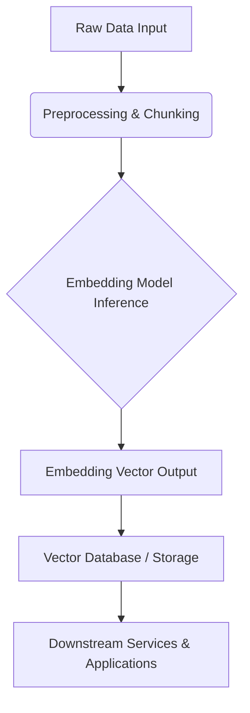
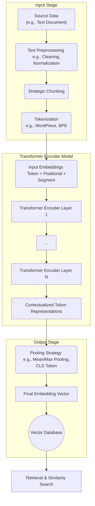

# Embedding Service Strategy: A Thought Document

## 1. Introduction

The effectiveness of our AI systems, particularly in areas like semantic search, content recommendation, and contextual understanding, hinges on a robust and sophisticated embedding strategy. Embeddings transform complex data (text, images, audio) into meaningful numerical representations (vectors) that machine learning models can process. This document explores various strategic considerations for implementing our embedding service, with a core emphasis on **adaptability** to accommodate evolving models, data types, and contextual requirements.

The goal is to design an embedding service that is not only powerful and efficient today but also flexible enough to integrate future advancements in embedding technology seamlessly.

## 2. Embedding Model Strategies

Choosing the right embedding model(s) is crucial. The decision involves balancing performance, complexity, cost, and the specific needs of downstream applications.

### 2.1. Single Highly Capable Model

Employing a single, state-of-the-art, general-purpose embedding model.

*   **Pros:**
    *   **Simplicity:** Easier management, deployment, and maintenance.
    *   **Consistency:** Uniform embeddings across all data types (if the model supports them).
    *   **Potentially Lower Operational Overhead:** Fewer models to monitor and update.
*   **Cons:**
    *   **Sub-optimal for Niche Tasks:** A general model might not capture nuances specific to certain data types or highly specialized domains as well as a tailored model.
    *   **Vendor/Model Lock-in:** Reliance on a single model provider or architecture can limit flexibility.
    *   **Resource Intensive:** Top-tier models can be computationally expensive.

### 2.2. Multiple Specialized Models

Utilizing a suite of different embedding models, each chosen for its strengths with particular data types or tasks. This could include models like traditional BERT or LSTM for specific sequence understanding, and advanced models like BAAI's BGE (BAAI General Embedding) series for high-performance, multi-faceted embeddings.

*   **Pros:**
    *   **Optimized Performance:** Tailored embeddings for different modalities (e.g., text, code, images) or specific semantic aspects.
    *   **Flexibility & Future-Proofing:** Easier to adopt new, specialized models as they emerge.
    *   **Multi-faceted Embeddings:** Different models can capture diverse aspects of the data (e.g., one for semantic similarity, another for sentiment, another for entity relationships). These can be used simultaneously or combined.
    *   **Risk Mitigation:** Diversification reduces dependency on a single model's performance or availability.
*   **Cons:**
    *   **Increased Complexity:** Managing multiple models, their versions, and their outputs requires a more sophisticated infrastructure.
    *   **Integration Challenges:** Combining or choosing between different embeddings for a single query can be complex.
    *   **Resource Management:** Potentially higher overall resource consumption if not managed efficiently.

### 2.3. Hybrid Approach

This strategy involves using a primary, highly capable general-purpose model for most tasks, supplemented by specialized models for specific use cases where the general model falls short or where a different facet of the data needs to be emphasized.

*   **Selection Logic:** A routing mechanism or a meta-model could decide which embedding (or combination of embeddings) is most appropriate based on the input data type, query context, or task requirements.
*   **Ensemble Techniques:** Embeddings from multiple models could be concatenated, averaged, or combined using more sophisticated learnable weighting schemes to produce a richer, more robust final embedding.

**Recommendation:** A hybrid approach, leaning towards multiple specialized models managed by a flexible framework, offers the best balance of performance and adaptability for a system designed for long-term evolution. The BGE series, for instance, provides strong baseline models that can be complemented by others.

## 3. Optimizing the Ingestion Pipeline

The quality of embeddings is directly influenced by the ingestion pipeline. An optimized pipeline ensures high-quality, consistent, and usable embeddings.

*   **Data Preprocessing:**
    *   **Cleaning:** Removing noise, irrelevant characters, or HTML tags.
    *   **Normalization:** Standardizing text (e.g., lowercasing, stemming/lemmatization, handling special characters).
    *   **Chunking:** Strategically splitting large documents into smaller, coherent segments suitable for the chosen model's context window. Chunking strategy significantly impacts retrieval quality.
    *   **Metadata Enrichment:** Capturing and associating relevant metadata (source, timestamps, author, etc.) with the data before embedding.
*   **Embedding Quality:**
    *   Consistent preprocessing ensures that similar semantic content yields similar embeddings.
    *   Tuning preprocessing steps based on model sensitivities is crucial.
*   **AI Persistence (Vector Storage & Management):**
    *   Embeddings must be stored efficiently in a vector database (e.g., Weaviate, Pinecone, Milvus) that supports fast similarity searches.
    *   The storage solution should handle versioning of embeddings, especially if models or preprocessing steps change.
    *   Metadata associated with embeddings must be indexed and searchable alongside the vectors.
*   **Usability:**
    *   Downstream services need easy and efficient access to embeddings and their associated metadata.
    *   Clear APIs for querying and retrieving embeddings are essential.
    *   The pipeline should be designed for easy updates and re-indexing when new models are introduced or data is updated.
*   **Feedback Loops:**
    *   Implement mechanisms to evaluate embedding quality (e.g., using labeled datasets, user feedback on search results).
    *   Use this feedback to refine preprocessing steps, chunking strategies, or even model choices.

## 4. Embedding Process and Data Flow (Transformer Architecture)

Understanding the data flow within a transformer-based embedding model helps in designing and troubleshooting the service.

### 4.1. High-Level Embedding Generation



### 4.2. Detailed Transformer-Based Embedding Process

This diagram illustrates the typical stages within a transformer model when generating embeddings:


*   **Tokenization:** Input text is broken down into tokens recognized by the model.
*   **Input Embeddings:** Each token is mapped to an initial vector, combined with positional information.
*   **Transformer Encoder Layers:** Multiple layers of multi-head self-attention and feed-forward networks process these embeddings to capture contextual relationships.
*   **Pooling Strategy:** The output token representations are aggregated (e.g., averaging, using the CLS token's representation) to form a single fixed-size vector representing the input chunk.

## 5. Adaptable Data Schemas for Embeddings

As models evolve and our understanding of context deepens, the data schemas used to store embeddings and their associated metadata must be adaptable.

*   **Why Adaptability is Crucial:**
    *   **Model Evolution:** New models may produce embeddings of different dimensions or capture different semantic nuances, requiring schema adjustments.
    *   **Changing Context:** The way we want to use or filter embeddings might change, necessitating new metadata fields.
    *   **New Data Types:** Support for new data modalities (e.g., video, multimodal inputs) will require schema extensions.
*   **Key Elements of an Embedding Schema:**
    *   `embedding_id`: Unique identifier for the embedding record.
    *   `source_content_id`: Identifier linking back to the original content (e.g., document ID, image ID).
    *   `source_chunk_id` (optional): Identifier for the specific chunk if the source content was segmented.
    *   `embedding_vector`: The numerical vector.
    *   `model_name`: Name of the model used (e.g., "bge-large-en-v1.5").
    *   `model_version`: Version of the model.
    *   `model_parameters` (optional): Key parameters used during embedding generation (e.g., `max_length`, `pooling_strategy`).
    *   `dimensionality`: The dimension of the `embedding_vector`.
    *   `generation_timestamp`: When the embedding was created.
    *   `schema_version`: Version of this embedding schema itself.
    *   `source_metadata`: A flexible field (e.g., JSONB) to store metadata from the original content (e.g., `document_type`, `creation_date`, `author`).
    *   `tags_categories`: Array of tags or categories for filtering and organization.
    *   `custom_fields`: A flexible structure for any additional, evolving contextual information.

*   **Example Conceptual Schema (JSON):**
    ```json
    {
      "embedding_id": "uuid-emb-123",
      "source_content_id": "doc-abc-789",
      "source_chunk_id": "chunk-002",
      "embedding_vector": "[0.123, -0.456, ..., 0.789]",
      "dimensionality": 1024,
      "model_name": "bge-large-en-v1.5",
      "model_version": "1.5.0",
      "model_parameters": {
        "pooling_strategy": "cls_token"
      },
      "generation_timestamp": "2025-05-08T10:30:00Z",
      "schema_version": "1.1",
      "source_metadata": {
        "original_filename": "project_plan_v3.docx",
        "author_id": "user-xyz",
        "content_type": "application/vnd.openxmlformats-officedocument.wordprocessingml.document"
      },
      "tags_categories": ["project_memoRable", "technical_strategy", "q2_planning"],
      "custom_fields": {
        "project_phase": "alpha",
        "sensitivity_level": "internal"
      }
    }
    ```

*   **Strategies for Schema Evolution:**
    *   **Schema Versioning:** Include a `schema_version` field in every embedding record.
    *   **Backward Compatibility:** Design new schemas to be backward compatible with older versions where possible, or provide clear migration paths.
    *   **Flexible Fields:** Utilize JSONB or similar flexible data types for fields that are expected to change frequently or vary widely.
    *   **Schema Registry:** Consider using a schema registry to manage and document schema versions and their evolution.
    *   **Lazy Migrations:** Update schemas on read or during background maintenance tasks rather than all at once, especially for large datasets.

## 6. Conclusion: Designing for Adaptability

The embedding service is a cornerstone of our AI capabilities. By prioritizing **adaptability** in our choice of models, pipeline design, and data schemas, we can build a system that remains effective and relevant as the landscape of AI and embedding technology continues its rapid evolution.

A hybrid model strategy, coupled with a meticulously optimized ingestion pipeline and flexible data schemas, will provide the resilience and forward-compatibility necessary for long-term success. Continuous evaluation and iteration based on performance metrics and emerging research will be key to maintaining a state-of-the-art embedding service.