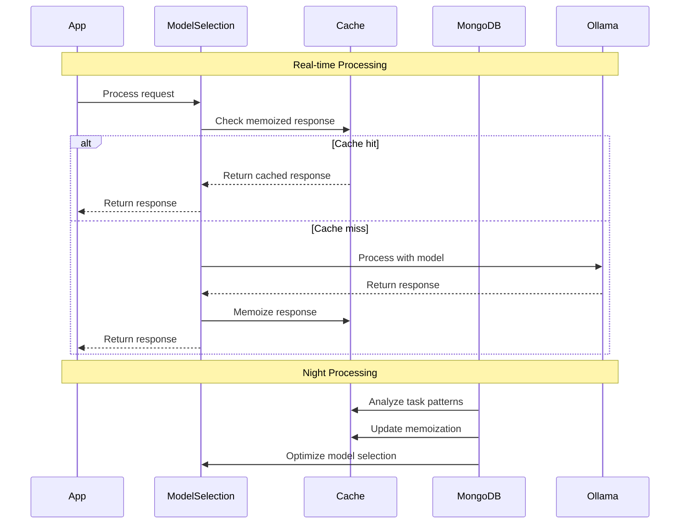
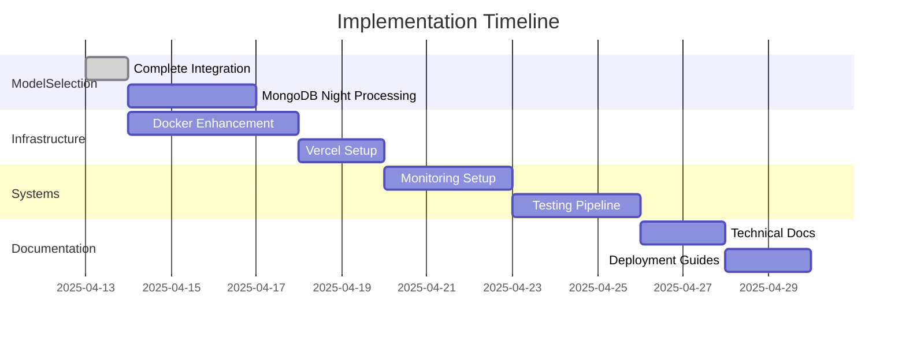

# MemoRable Implementation Plan - Next Steps

## Current Progress Analysis



## Immediate Action Items

### 1. ModelSelectionService Integration (Completed)
- ✓ Added performance monitoring capabilities
- ✓ Implemented dynamic model switching
- ✓ Added memory usage tracking
- ✓ Enhanced logging system
- ✓ Added model warm-up functionality
- ✓ Implemented response memoization
- ✓ Added task pattern tracking
- ✓ Added model state management

### 2. Docker Configuration Enhancement (Priority: High)
- Add model preloading scripts
- Configure resource limits for different environments
- Implement model caching strategy
- Add health checks for model availability
- Setup automatic model updates

### 3. Vercel Deployment Setup (Priority: High)
- Create vercel.json configuration
  ```json
  {
    "version": 2,
    "builds": [
      {
        "src": "src/index.js",
        "use": "@vercel/node"
      }
    ],
    "routes": [
      {
        "src": "/(.*)",
        "dest": "src/index.js"
      }
    ],
    "env": {
      "NODE_ENV": "production"
    }
  }
  ```
- Configure build and deployment scripts
- Set up environment variables
- Implement production-specific optimizations

### 4. MongoDB Night Processing (Priority: High)
- Implement task pattern analysis
- Create model performance metrics aggregation
- Set up automated model optimization
- Configure cache warming strategies
- Implement memory usage predictions

### 5. Environment-Specific Configuration (Priority: Medium)
- Implement environment detection improvements
- Add resource allocation profiles
- Configure model fallback chains
- Setup monitoring thresholds

### 6. Monitoring System Implementation (Priority: Medium)
- Set up centralized logging
- Implement performance metrics collection
- Add system health monitoring
- Configure alerting thresholds

### 7. Documentation Updates (Priority: Medium)
- Document deployment procedures
- Update configuration guides
- Add troubleshooting guides
- Create environment setup instructions

### 8. Testing Pipeline (Priority: Medium)
- Implement model integration tests
- Add performance benchmarks
- Create load testing scripts
- Set up continuous testing

### 9. Backup and Recovery (Priority: Low)
- Implement model state backup
- Create recovery procedures
- Document failover processes
- Set up automated backups

## Implementation Timeline



## Risk Assessment

1. **High Priority Risks**
   - Model performance in production
   - Resource allocation efficiency
   - System stability during model switching
   - Cache invalidation timing
   - Memory usage during night processing

2. **Medium Priority Risks**
   - Integration testing coverage
   - Documentation completeness
   - Monitoring system effectiveness
   - Task pattern analysis accuracy

3. **Low Priority Risks**
   - Backup system reliability
   - Recovery time objectives
   - Documentation maintenance

## Next Review Points

1. After MongoDB night processing implementation
2. Post-Docker configuration updates
3. Following Vercel deployment setup
4. After monitoring system implementation

Would you like to proceed with implementing the MongoDB night processing functionality next?