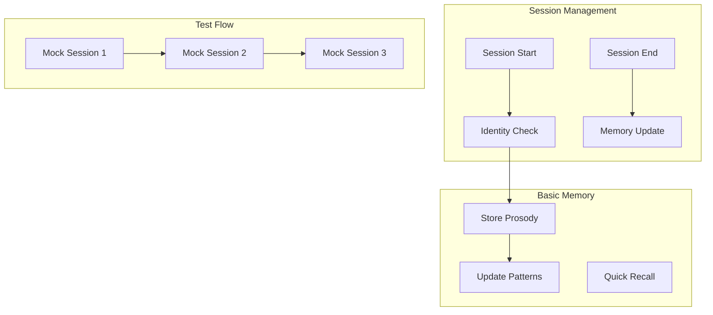

# MemoRable Proof of Concept

## Overview

Simple proof of concept implementation focusing on session management, identity recognition, and basic memory storage.



## Core Implementation

```javascript
// memorable.js
export class MemoRable {
  constructor() {
    this.sessions = new Map();
    this.memories = new Map();
    this.patterns = new Map();
  }

  async handleSessionStart(sessionData) {
    const sessionId = sessionData.sessionId;
    const userId = sessionData.userId;

    // Check if user exists
    const userMemory = this.memories.get(userId) || {
      chatCount: 0,
      lastSeen: null,
      patterns: []
    };

    // Update session data
    this.sessions.set(sessionId, {
      userId,
      startTime: Date.now(),
      chatCount: userMemory.chatCount + 1
    });

    return {
      isNewUser: userMemory.chatCount === 0,
      lastSeen: userMemory.lastSeen,
      patterns: userMemory.patterns
    };
  }

  async handleSessionEnd(sessionData) {
    const session = this.sessions.get(sessionData.sessionId);
    if (!session) return;

    // Update memory with session data
    await this.updateMemory(session.userId, {
      sessionLength: Date.now() - session.startTime,
      prosodyData: sessionData.prosody || [],
      patterns: sessionData.patterns || []
    });

    this.sessions.delete(sessionData.sessionId);
  }

  async processMessage(message, context) {
    const sessionId = context.sessionId;
    const session = this.sessions.get(sessionId);
    if (!session) return;

    // Store prosody data
    if (context.models?.prosody?.scores) {
      await this.storeProsody(session.userId, {
        scores: context.models.prosody.scores,
        timestamp: Date.now()
      });
    }

    return {
      userId: session.userId,
      chatCount: session.chatCount,
      hasPattern: await this.checkPattern(session.userId, message)
    };
  }
}
```

## Memory Storage

```javascript
class MemoryStore {
  constructor() {
    this.store = new Map();
  }

  async updateMemory(userId, data) {
    const memory = this.store.get(userId) || {
      sessions: [],
      prosody: [],
      patterns: []
    };

    // Update session data
    memory.sessions.push({
      timestamp: Date.now(),
      length: data.sessionLength,
      patterns: data.patterns
    });

    // Keep only last 10 sessions
    if (memory.sessions.length > 10) {
      memory.sessions = memory.sessions.slice(-10);
    }

    // Update prosody data
    memory.prosody.push(...data.prosodyData);

    // Keep only last 100 prosody records
    if (memory.prosody.length > 100) {
      memory.prosody = memory.prosody.slice(-100);
    }

    this.store.set(userId, memory);
  }

  async getProsodyPatterns(userId) {
    const memory = this.store.get(userId);
    if (!memory) return [];

    return this.analyzeProsodyPatterns(memory.prosody);
  }
}
```

## Test Flow

```javascript
// test.js
async function runProofOfConcept() {
  const memorable = new MemoRable();

  // Session 1 - New User
  console.log('Starting Session 1');
  const session1 = await memorable.handleSessionStart({
    sessionId: 'test1',
    userId: 'user1'
  });
  console.log('New User Check:', session1.isNewUser === true);

  // Mock some messages with prosody
  await memorable.processMessage(
    { content: 'Hello', type: 'user_message' },
    { 
      sessionId: 'test1',
      models: {
        prosody: {
          scores: {
            happiness: 0.8,
            confidence: 0.7
          }
        }
      }
    }
  );

  await memorable.handleSessionEnd({
    sessionId: 'test1',
    prosody: [
      { happiness: 0.8, confidence: 0.7 }
    ]
  });

  // Session 2 - Returning User
  console.log('\nStarting Session 2');
  const session2 = await memorable.handleSessionStart({
    sessionId: 'test2',
    userId: 'user1'
  });
  console.log('Returning User Check:', session2.isNewUser === false);
  console.log('Has Previous Patterns:', session2.patterns.length > 0);

  await memorable.processMessage(
    { content: 'Hi again', type: 'user_message' },
    {
      sessionId: 'test2',
      models: {
        prosody: {
          scores: {
            happiness: 0.9,
            confidence: 0.8
          }
        }
      }
    }
  );

  await memorable.handleSessionEnd({
    sessionId: 'test2',
    prosody: [
      { happiness: 0.9, confidence: 0.8 }
    ]
  });

  // Session 3 - Pattern Recognition
  console.log('\nStarting Session 3');
  const session3 = await memorable.handleSessionStart({
    sessionId: 'test3',
    userId: 'user1'
  });
  console.log('Pattern Check:', session3.patterns.length > 0);

  const messageResult = await memorable.processMessage(
    { content: 'Hello', type: 'user_message' },
    {
      sessionId: 'test3',
      models: {
        prosody: {
          scores: {
            happiness: 0.8,
            confidence: 0.7
          }
        }
      }
    }
  );

  console.log('Pattern Recognition:', messageResult.hasPattern === true);

  await memorable.handleSessionEnd({
    sessionId: 'test3',
    prosody: [
      { happiness: 0.8, confidence: 0.7 }
    ]
  });
}

// Run the proof of concept
runProofOfConcept().catch(console.error);
```

## Implementation Steps

1. **Setup Basic Structure**
   - Create npm package
   - Implement core classes
   - Add test framework

2. **Session Management**
   - Add session tracking
   - Implement memory storage
   - Create pattern detection

3. **Test Implementation**
   - Run proof of concept
   - Verify identity tracking
   - Check pattern recognition

## Success Metrics

1. **Identity Management**
   - New user detection 100%
   - Returning user recognition 100%
   - Session tracking accuracy 100%

2. **Memory Processing**
   - Prosody storage complete
   - Pattern detection working
   - Memory limits enforced

## Next Steps

1. Create npm package
2. Implement core classes
3. Add test framework
4. Run proof of concept
5. Verify results

The system will demonstrate basic identity recognition and memory storage with mock prosody data across three test sessions.