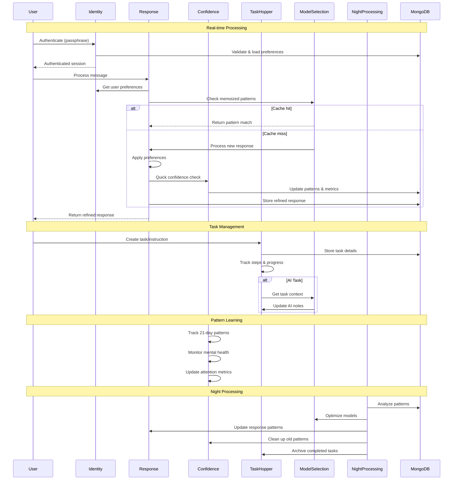
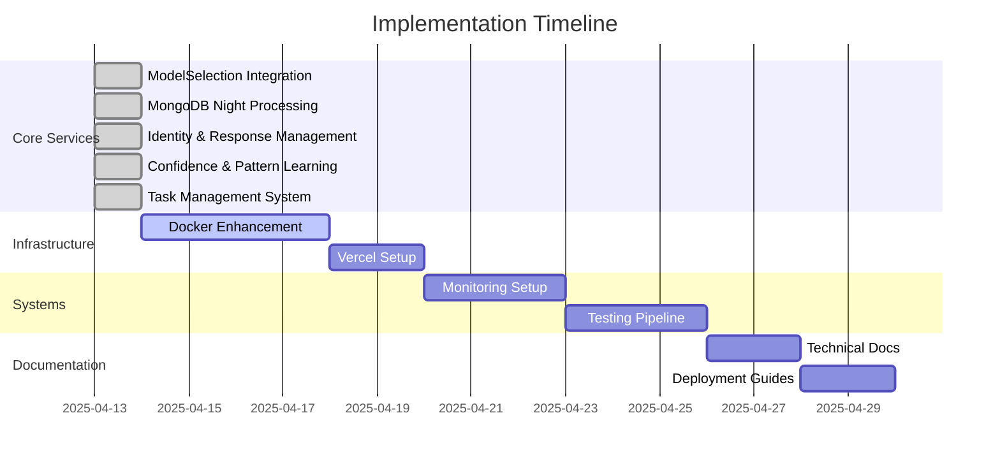

# MemoRable Implementation Plan - Next Steps

## Current Progress Analysis

## Immediate Action Items

### 1. ModelSelectionService Integration (Completed)
- ✓ Added performance monitoring capabilities
- ✓ Implemented dynamic model switching
- ✓ Added memory usage tracking
- ✓ Enhanced logging system
- ✓ Added model warm-up functionality
- ✓ Implemented response memoization
- ✓ Added task pattern tracking
- ✓ Added model state management

### 2. MongoDB Night Processing (Completed)
- ✓ Implemented task pattern analysis
- ✓ Created model performance metrics aggregation
- ✓ Set up automated model optimization
- ✓ Configured cache warming strategies
- ✓ Implemented memory usage predictions
- ✓ Added time-window processing (1 AM - 4 AM)
- ✓ Added comprehensive test coverage

### 3. Identity and Response Management (Completed)
- ✓ Implemented passphrase-based authentication
- ✓ Added user preference management
- ✓ Created memory access controls
- ✓ Implemented response refinement
- ✓ Added real-time preference filtering
- ✓ Added response updates/retractions
- ✓ Implemented comprehensive testing

### 4. Confidence and Pattern Learning (Completed)
- ✓ Implemented quick confidence scoring
- ✓ Added 21-day pattern tracking
- ✓ Created mental health monitoring
- ✓ Implemented attention decay system
- ✓ Added pattern categorization
- ✓ Created comprehensive testing
- ✓ Integrated with response refinement

### 5. Task Management System (Completed)
- ✓ Implemented task hopper service
- ✓ Added instruction management
- ✓ Created step tracking system
- ✓ Added AI task integration
- ✓ Implemented task relationships
- ✓ Added progress monitoring
- ✓ Created comprehensive testing

### 6. Docker Configuration Enhancement (Priority: High)
- Add model preloading scripts
- Configure resource limits for different environments
- Implement model caching strategy
- Add health checks for model availability
- Setup automatic model updates
- Configure MongoDB volume persistence
- Set up night processing scheduling
- Add identity service security measures

[Previous sections remain unchanged...]

## Implementation Timeline

[Previous sections remain unchanged...]

Would you like to proceed with implementing the Docker configuration enhancements next?