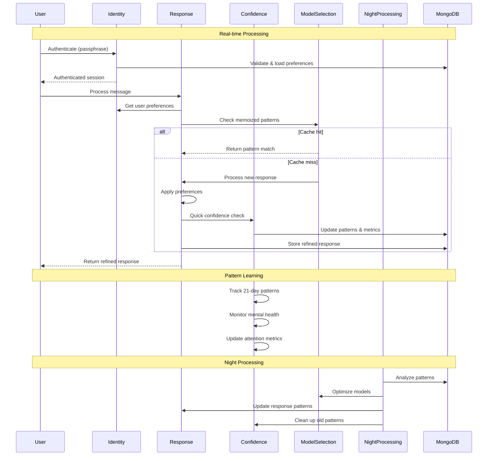
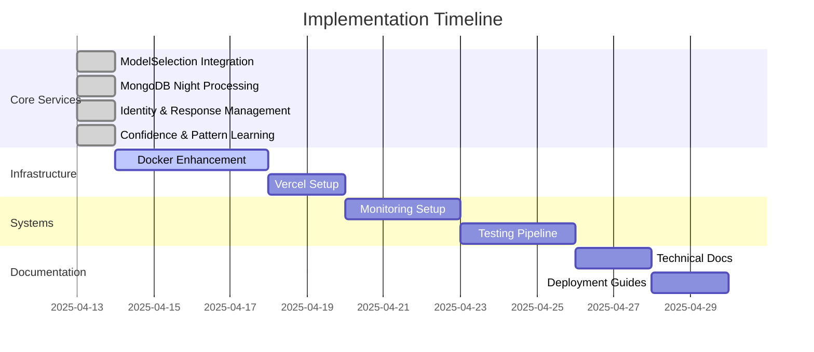

# MemoRable Implementation Plan - Next Steps

## Current Progress Analysis



## Immediate Action Items

### 1. ModelSelectionService Integration (Completed)
- ✓ Added performance monitoring capabilities
- ✓ Implemented dynamic model switching
- ✓ Added memory usage tracking
- ✓ Enhanced logging system
- ✓ Added model warm-up functionality
- ✓ Implemented response memoization
- ✓ Added task pattern tracking
- ✓ Added model state management

### 2. MongoDB Night Processing (Completed)
- ✓ Implemented task pattern analysis
- ✓ Created model performance metrics aggregation
- ✓ Set up automated model optimization
- ✓ Configured cache warming strategies
- ✓ Implemented memory usage predictions
- ✓ Added time-window processing (1 AM - 4 AM)
- ✓ Added comprehensive test coverage

### 3. Identity and Response Management (Completed)
- ✓ Implemented passphrase-based authentication
- ✓ Added user preference management
- ✓ Created memory access controls
- ✓ Implemented response refinement
- ✓ Added real-time preference filtering
- ✓ Added response updates/retractions
- ✓ Implemented comprehensive testing

### 4. Confidence and Pattern Learning (Completed)
- ✓ Implemented quick confidence scoring
- ✓ Added 21-day pattern tracking
- ✓ Created mental health monitoring
- ✓ Implemented attention decay system
- ✓ Added pattern categorization
- ✓ Created comprehensive testing
- ✓ Integrated with response refinement

### 5. Docker Configuration Enhancement (Priority: High)
- Add model preloading scripts
- Configure resource limits for different environments
- Implement model caching strategy
- Add health checks for model availability
- Setup automatic model updates
- Configure MongoDB volume persistence
- Set up night processing scheduling
- Add identity service security measures

### 6. Vercel Deployment Setup (Priority: High)
- Create vercel.json configuration
  ```json
  {
    "version": 2,
    "builds": [
      {
        "src": "src/index.js",
        "use": "@vercel/node"
      }
    ],
    "routes": [
      {
        "src": "/(.*)",
        "dest": "src/index.js"
      }
    ],
    "env": {
      "NODE_ENV": "production"
    }
  }
  ```
- Configure build and deployment scripts
- Set up environment variables
- Implement production-specific optimizations
- Configure MongoDB Atlas connection
- Set up secure passphrase handling

### 7. Environment-Specific Configuration (Priority: Medium)
- Implement environment detection improvements
- Add resource allocation profiles
- Configure model fallback chains
- Setup monitoring thresholds
- Configure identity service modes

### 8. Monitoring System Implementation (Priority: Medium)
- Set up centralized logging
- Implement performance metrics collection
- Add system health monitoring
- Configure alerting thresholds
- Add user interaction monitoring

### 9. Documentation Updates (Priority: Medium)
- Document deployment procedures
- Update configuration guides
- Add troubleshooting guides
- Create environment setup instructions
- Document identity management

### 10. Testing Pipeline (Priority: Medium)
- Implement model integration tests
- Add performance benchmarks
- Create load testing scripts
- Set up continuous testing
- Add security testing

### 11. Backup and Recovery (Priority: Low)
- Implement model state backup
- Create recovery procedures
- Document failover processes
- Set up automated backups
- Add user preference backups

## Implementation Timeline



## Risk Assessment

1. **High Priority Risks**
   - Model performance in production
   - Resource allocation efficiency
   - System stability during model switching
   - Cache invalidation timing
   - Memory usage during night processing
   - MongoDB performance under load
   - Passphrase security
   - Response refinement accuracy
   - Pattern learning accuracy
   - Mental health monitoring reliability

2. **Medium Priority Risks**
   - Integration testing coverage
   - Documentation completeness
   - Monitoring system effectiveness
   - Task pattern analysis accuracy
   - Night processing window timing
   - User preference conflicts
   - Attention decay balance

3. **Low Priority Risks**
   - Backup system reliability
   - Recovery time objectives
   - Documentation maintenance
   - Cache storage limits
   - Pattern storage growth

## Next Review Points

1. After Docker configuration updates
2. Following Vercel deployment setup
3. After monitoring system implementation
4. First week of night processing results
5. Initial user interaction analysis
6. First 21-day pattern analysis

Would you like to proceed with implementing the Docker configuration enhancements next?